# Index 

* [معرفی](#intro)
* [نصب روی کامپیوتر شخصی (Windows + Nvidia)](#install)
* [شروع توضیحات](#start)
   1. [مدل ها](#model)
   1. [توضیحات VAE](#vae)
   1. [درخواست ها](#prompt)
   1. [معیارهای تولید تصویر](#gen)
* [افزودنی ها](#extensions)
* [توضیحات Lora](#lora)
   * [توضیحات Lycoris](#lycoris)
* [بزرگ کردن اندازه](#upscale)
* [اسکریپت ها](#imgscripts)
   * [توضیحات - X/Y/Z Plot](#plot)
   * [ماتریکس درخواست - Prompt Matrix](#matrix)
   * [توضیحات Ultimate Upscaler](#ultimate)
* [کنترل نت](#controlnet)
* [آموزش دادن Lora برای تازه کارها](#train)
* [بخش های جا مانده](#vtubers)
 
&nbsp;

# معرفی [▲](#index)
استیبل دیفیوژن (که به اختصار به آن SD میگوییم) یک نرم افزار قدرتمند تولید تصویر هوش مصنوعی است که میتوانید آن را بصورت آنلاین و یا بر روی کامپیوتر شخصی نصب و استفاده کنید (فعلا کاملا رایگان است و متن باز). SD از مدل ها "models" که شبیه به مغز هوش مصنوعی عمل میکنند و افرادی آن را آموزش داده اند تا فعالیت های مشخصی انجام دهد استفاده میکند و تقریبا میتواند هر چیزی بسازد. بیشترین استفاده های کاربران فعلا برای انیمه، تصاویر مشابه حقیقی و محتوای NSFW (نا مناسب برای کار/محتوای بزرگسالان/محتوای زننده یا تحریک کننده) است.  

از نگاه قانونی شما مسئول هر نوع تولیدی با آن هستید و افراد سازنده آن مسئولیتی ندارند. 

آخرین تغییرات این راهنما بر اساس نرم افزار آپدیت شده در مارچ 2023 می باشد و با توجه به اینکه یک هفته زمان مثل یک سال در صنعت هوش مصنوعی می ماند، ممکن است در زمان مطالعه این راهنما، تغییراتی در نرم افزار ایجاد شده باشد. 

&nbsp;

# نصب و استفاده آنلاین با استفاده از Google Colab

راهی راحت و برای استفاده از SD بصورت آنلاین و بدون داشتن سخت افزار شخصی استفاده از این سرویس است که از کامپیوترهای گوگل به جای سخت افزار خودتان استفاده میکنید. برای ذخیره تنظیمات و همچنین تصاویر تولید شده از گوگل درایو استفاده میکنیم. 

ابتدا به لینک  [این صفحه](https://colab.research.google.com/drive/1wEa-tS10h4LlDykd87TF5zzpXIIQoCmq) مراجعه کنید

سپس نزدیک به بالای صفحه روی **Copy to Drive** کلیک کنید.منتظر شوید تا صفحه جدید باز شود و صفحه قدیمی را ببندید. حالا داخل صفحه کولب شخصی خود هستید که تنظیمات سفارشی شما را نگه میدارد که از این به بعد باید آن را از داخل گوگل درایوتان باز کنید. اگر برای محتوای اصلی (صفحه قدیمی) آپدیتی ارائه شود شما نیز باید آن را جایگزین کنید تا بتواید از مزایای آن استفاده کنید.  

حال در بخش **Configurations** این تنظیمات را فعال کنید: `output_to_drive, configs_in_drive, no_custom_theme` و در بخش **Models, VAEs, etc** اینها را فعال کنید:`anything_vae`, `wd_vae`, `sd_vae` 

اگر از قبل با SD آشنایی کمی داشته باشید میتوانید با استفاده از باکس متنی `custom_urls` از لینک های منابع مورد نظرتان نیز استفاده کنید که تعدادی از آنها را معرفی کرده ایم. لینکها باید بصورت مستقیم(**direct downloads**) باشند تا هر فایل (ترجیحا از civitai یا huggingface باشند) نصب شود و لینکها می بایست با کاما از هم جدا شوند. 

حال دکمه پلی را در سکشن اول از صفحه که با برچسب **Start 🚀** مشخص شده است را بزنید. چند دقیقه منتظر بمانید تا عملیات ها انجام شوند و لینک عمومی **public link** ایجاد شود که با آن یک تب جدید را میتوانید باز کنید و استفاده از استیبل دیفیوژن را آغاز کنید. **تب مربوط به کولب را باز نگهدارید** (برای موبایل هم به همین صورت تب باز باشد) 

&nbsp;

# نصب روی کامپیوتر شخصی (Windows + Nvidia) [▲](#index)

برای اجرای استیبل دیفیوژن روی کامپیوتر خود حداقل به 16 گیگابایت رم و گرافیکی با حداقل 4 گیگابایت وی رم (8 گیگ توصیه می شود) نیاز دارید. این راهنما بصورت عمومی ویندوز 10 و 11 را با استفاده از کارت گرافیک NVIDIA سری های 16XX, 20XX یا 30XX پشتیبانی می کند. پوزش از کاربران لینوکس، مک و همچنین صاحبین کارت های گرافیک AMD چون این راهنما آنها را در بر نمیگیرد و راه اندازی استیبل دیفیوژن برای آنها پر دردسرتر و پر از ایرادات فنی است. توصیه میشود از همان آموزش کولب که در مرحله قبل ارائه شد استفاده کنید.   

ابتدا آخرین نسخه ریلیز را [از این صفحه](https://github.com/EmpireMediaScience/A1111-Web-UI-Installer/releases) دانلود کنید. 

سپس فایل اینستالر را اجرا کنید و فولدری که میخواهید آنجا نصب شود را مشخص کنید و تا پایان نصب صبر کنید.

حال برنامه را اجرا کنید. گزینه های **medvram** و **xformers** را فعال کنید. اگر وی رم گرافیک شما 12 گیگ یا بیشتر است نیاز به فعال کردن medvram نیست. 
 
تنظیمات اضافی (**Additional Launch Options**) را به این روش میتوانید انجام دهید: `--opt-channelslast --no-half-vae --theme dark` . هر نوع تنظیم دیگری را که مایل باشید میتوانید اضافه کنید و با اسپیس (فضای خالی) آنها را از هم جدا کنید.
   توجه* اگر وی رم کارت گرافیک شما 4تا6 گیگابایت است مقدار `--opt-split-attention-v1` را نیز اضافه کنید چون ممکن است بتوانید از وی رم کمتری استفاده کنید.
   توجه* اگر میخواهید برنامه را روی کامپیوتر خود اجرا کنید ولی از دستگاه دیگری برای کار کردن با برنامه استفاده کنید (مثلا با موبایل)، مقدار `--listen --enable-insecure-extension-access` را نیز اضافه کنید. پس از اجرا، IP لوکال خود را میتوانید از یک وای فای که هردو دستگاه به آن متصل هستند را در مرورگر موبایل باز کنید تا رابط کاربری را مشاهده کنید. همچنین میتوانید روی آن رمز هم بگذارید، فقط کافیست مقداری مثللا مشابه این را نیز اضافه کنید `--gradio-auth name:1234` 
    در صورت تمایل* لیست کامل پارامترهای قابل استفاده را میتوانید [اینجا](https://github.com/AUTOMATIC1111/stable-diffusion-webui/wiki/Command-Line-Arguments-and-Settings) بینید. 

اکنون بر روی **Launch** کلیک کنید و منتظر بمانید تا صفحه رابط کاربری آن در مرورگر شما باز شود. برای اولین بار مقداری طول میکشد تا دانلودها انجام شود یا هروقت نیاز به فایلی باشد که بر روی سیستم موجود نیست برنامه اتوماتیک آن را دانلود میکند. 

صفحه حالا باز شده. این یک وبسایت خصوصی متعلق به شماست. صفحه ابتدایی، همان جاییست که میتوانید از طریق وارد کردن متن یک یا چند تصویر ایجاد کنید. اما قبل از شروع به تب تنظیمات(**Settings**) بروید. سکشن تنظیمات در بخش چپ صفحه است.
     در سکشن *Stable Diffusion* به پایین اسکرول کنید و مقدار **Clip Skip** را از 1 به 2 تغییر دهید. این کار برای ایجاد تصاویر بهتر (به خصوص برای انیمه) کمک میکند. 
     در سکشن *User Interface* به پایین اسکرول کنید و **Quicksettings list** را به `sd_model_checkpoint, sd_vae` تغییر دهید
     با اسرول به بالا برگردید و بر روی دکمه نارنجی رنگ بزرگ که برروی آن نوشته **Apply settings** بزنید و بعد **Reload UI** کنار آن را بزنید.
    
حالا میتوانید با داشتن مدل پایه ای که نصب شده است تصاویر را تولید کنید که البته ممکن است زیاد مورد پسند نباشد. من از مدل پایه Runway استفاده میکنم که اگر تمایل داشته باشید میتوانید آن را دانلود و در پوشه مدل ها قرار دهید. حجم این فایل بزرگ است و حدود 8 گیگابایت میباشد: https://huggingface.co/runwayml/stable-diffusion-v1-5/blob/main/v1-5-pruned.ckpt  و برای فاین تیون نیز مناسب است و همچنین بصورت پیشفرض فیلترهای سنسور و حذف خروجی های بزرگسالان در آن وجود ندارد

 &nbsp;

# شروع توضیحات [▲](#index)

اگر طبق توضیحات قبلی پیش رفته باشید رابط کاربری شما چیزی شبیه به این تصویر است که با هم به تشریح و یادگیری اولیه آن میپردازیم:

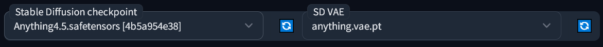

اینجا میتوانید چک پوینت ها (مدل ها) و VAE را انتخاب کنید. در حالت استفاده از کولب گزینه های اضافه دیگری هم هست که فعلا از آنها چشم پوشی میکنیم تا توضیحات اصلی را بیان کنیم 

**مدل ها (چک پوینت)** [▲](#index)

   همانطور که گفته شد مدل ها را چک پینت نیز می نامند که مغز هوش مصنوعی شما هستند و برای اهداف تولید انواع مختلفی از تصاویر طراحی شده اند. گزینه های بسیار زیاد و متنوعی از آنها وجود دارد (به خصوص در پلتفرم [civitai](https://civitai.com) ) اما کدام را انتخاب کنیم؟ تعدادی پیشنهاد به شما ارائه میدهم: 
   
   مدل [7th Heaven Mix](https://civitai.com/models/4669/corneos-7th-heaven-mix) برای انیمه قابلیت های مشابه تصاویر سینمایی خوبی دارد و مدل [Abyss Orange Mix 3](https://civitai.com/models/9942/abyssorangemix3-aom3) تصاویری واقع گرایانه تر با شیدینگ نرم تر و نورپردازی حرفه ای تر ارائه می دهد. نویسنده این راهنما (نسخه انگلیسی) این دو مدل را با هم مرج کرده و در اختیار شما گذاشته است [Heaven Orange Mix](https://civitai.com/models/14305/heavenorangemix) که ترکیبی از هردو است. 
   
   مدل های معرفی شده برای تصاویر NSFW قدرتمند هستند و رقیب محبوبی نیز به اسم [Grapefruit](https://civitai.com/models/2583/grapefruit-hentai-model) دارند که برای hentai استفاده می شود.
   
   برای آثار هنری بصورت عمومی مدل [DreamShaper](https://civitai.com/models/4384/dreamshaper) گزینه های مناسبی برای خلاقیت ارائه می دهد. همچنین استفاده از [Pastel Mix](https://civitai.com/models/5414/pastel-mix-stylized-anime-model) میتواند آثار هنری زیبا و منحصر به فردی را برایتان فراهم کند. 
   
   برای فوتوریلیسم استفاده از [Deliberate](https://civitai.com/models/4823/deliberate) نتایج بسیار جالبی ارائه میدهد. 
   
   کاربرد مدل [Uber Realistic Porn Merge](https://civitai.com/models/2661/uber-realistic-porn-merge-urpm) نیز که از نام آن مشخص است و نیازی به توضیح ندارد. 
   

   اگر از colab در این راهنما استفاده میکنید **لینک مستقیم فایل مدل** را کپی کنید و در باکس متنی ای که با لیبل `custom_urls` مشخص شده است قرار دهید تا بتوانید نصبشان کنید. همچنین لینک های متعدد را با کاما از هم جدا کنید تا بتوانید همزمان این کار را انجام دهید. &nbsp;
   اگر برنامه را روی کامپیوتر شخصی استفاده می کنید مدل ها را معمولا در پوشه `stable-diffusion-webui/models/Stable-diffusion` قرار میدهند

   چک پوینت ها یا مدل هایی که فایل آنها با پسوند `.safetensors` ارائه شده اند برای استفاده امن هستند. فایل هایی که با پسوند `.ckpt` ارائه میشوند **می توانند/ممکن است** حاوی ویروس باشند پس ابتدا از منبع ارائه دهنده فایل مطمئن شوید. همچنین در زمان انتخاب فایل ها ممکن است گزینه های متعددی مثل fp32، fp16 و pruned را مشاهده کنید، تمام آنها برای تولید تصاویر نتایج تقریبا مشابهی با خطای خیلی کمی ارائه میدهند پس استفاده از فایل های با حجم کمتر (pruned-fp16) نتایج مناسبی دارد و نیاز به استفاده از فایل های حجیم تر نیست. اما اگر میخواهید از فایل ها برای آموزش چک پوینت اختصاصی خود و یا مرج کردن چند مدل با هم استفاده کنید از فایل های حجیم تر استفاده کنید.  

 **توضیحات VAEها** [▲](#index)

   بیشتر چک پوینت ها با VAE درونی ارائه نمی شوند. VAE یک مدل مجزای کوچک است که "تصاویر را به فرمت انسانی تبدیل میکند". بدون آن شما رنگ های فید شده، چشم های زشت و دیگر چیزهای نامناسب را در خروجی خواهید دید.
   
   ما سه مدل مختلف VAE در حال استفاده داریم:

   مدل [anything vae](https://huggingface.co/WarriorMama777/OrangeMixs/resolve/main/VAEs/orangemix.vae.pt) که با نام اورنج میکس هم شناخته می شود و بیشتر مدل های انیمه از آن استفاده می کنند.

   مدل [vae-ft-mse](https://huggingface.co/stabilityai/sd-vae-ft-mse-original/blob/main/vae-ft-mse-840000-ema-pruned.safetensors) که توسط خود استیبل دیفیوژن ارائه شده است و توسط بیشتر مدل های فوتوریلیسم و مشابه آن استفاده می شود

   مدل [kl-f8-anime2](https://huggingface.co/hakurei/waifu-diffusion-v1-4/resolve/main/vae/kl-f8-anime2.ckpt) که به وایفو دیفیوژن هم شناخته می شود که قدیمی تر است و بیشتر نتایج اشباع شده ارائه می دهد که توسط Pastel Mix و امثال آن استفاده می شود.
   
   
   فایل های مربوط به VAE ها معمولا در پوشه `stable-diffusion-webui/models/VAE` قرار میگیرند 
   

   **درخواست ها / Prompts** [▲](#index)

   در اولین تب **txt2img** شما بیشتر تصاویرتان را می سازید. اینجا جاییست که درخواست *prompt* خود و چیزهایی که نمیخواهید در آن باشد (*negative prompt*/درخواست منفی) را وارد میکنید. استیبل فیوژن مثل میدجرنی () یا دیگر نرم افزارهای مشابه نیست که فقط از آنها درخواستی کلی برای تولید چیزی کنید، باید به طور واضح آن را مشخص کنید، *خیلی* واضح. اغلب مردم یک پرامپت (درخواست) پیدا میکنند که کارشان را راه می اندازد و از آن استفاده میکنند یا از دیگران برای پیشنهادات کمک میک می گیرند. اینجا چند نمونه پرامپت و پرامپت منفی شخصی را نشان میدهم:
   
   * برای انیمه:
      * `2d, masterpiece, best quality, anime, highly detailed face, highly detailed background, perfect lighting`
      * `EasyNegative, worst quality, low quality, 3d, realistic, photorealistic, (loli, child, teen, baby face), zombie, animal, multiple views, text, watermark, signature, artist name, artist logo, censored`
     
   * برای فتورلیسم: 
      * `best quality, 4k, 8k, ultra highres, raw photo in hdr, sharp focus, intricate texture, skin imperfections, photograph of`
      * `EasyNegative, worst quality, low quality, normal quality, child, painting, drawing, sketch, cartoon, anime, render, 3d, blurry, deformed, disfigured, morbid, mutated, bad anatomy, bad art`

   * **توضیح EasyNegative:** 
   استفاده از این پرامپت منفی که بصورت *embedding* یا کلمه جادویی "magic word" عمل میکند در واقع شامل تعداد زیادی پرامپت منفی است که به تولید تصاویر بهتر کمک میکند که اگر از آن استفاده نکنیم نیاز به نوشتن تعداد زیادی پرامپ منفی داریم که در پرامپت محدودیت کاراکتر داریم

      برای دانلود این فایل کوچک و نصب آن از [این لینک](https://huggingface.co/datasets/gsdf/EasyNegative/resolve/main/EasyNegative.safetensors) استفاده کنید و آن را در پوشه `stable-diffusion-webui/embeddings` قرار دهید و اگر برنامه در حال اجراست آن را ریلود *Reload UI* کنید. و هروقت آن کلمه را بنویسید (EasyNegative) عمل میکند 

   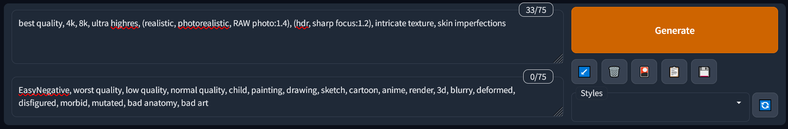

   بعد از نوشتن پرامپت ابتدایی یا پایه ای (شبیه پرامپت های بالا که مثال زده شد) خواسته های خود را اضافه میکنیم. مثلا `young woman in a bikini in the beach, full body shot` را اضافه میکنیم. همچنین برا پرامپت منفی نیز چیزهایی که مایل نیستیم در تصویر باشد را اضافه میکنیم...
   
   برای ذخیره کردن پرامپت های خود که بعدا از آنها بخواهید استفاده کنید بر روی دکمه 💾 *Save style* بزنید و برای آن اسمی قرار دهید تا بدانید به چه موضوعی اشاره دارد. بعدا از بخش *Styles* کشوی پایین رونده را باز کنید و آن را انتخاب کنید و علامت 📋 *Apply selected styles to the current prompt* را کلیک کنید تا از آن استفاده کنید. 

   یک تکنیک مهم برای نوشتن پرامپت تاکید (مثبت) و نفی کردن (تاکید منفی) بر کلمات است. وقتی چیزی را داخل پرانتز () میگذاریم برنامه **وزن** بیشتری در نتیجه تولید تصویر برای آن قائل می شود و به هوش مصنوعی میگوید که این قسمت مهمتر است. وزن معمول برای همه چیز برابر با 1 است و هر پرانتز آن را در 1.1 ضرب میکند تا وزن بیشتری بگیرد.(همچنین میتوانید از چندین پرانتر ((())) برای بالا بردن وزن استفاده کنید) 

   همچنین میتوانید وزن کلمات را بصورت مشخص نیز در پرامپت خود وارد کنید، مثل این نمونه: `(full body:1.4)`. و برای کاهش وزن آن میتوانید از براکت ها [] استفاده کنید تا وزن آن را در 0.9 ضرب کند ولی برای کاهش بیشتر هنوز اشاره مستقیم داخل پرانتز نیاز دارید مثل این:  `(this:0.5)`

   موضوع دیگر که باید به خاطر داشته باشید این است که فعلا برای هوش مصنوعی طراحی دست ها و پا مشکل است و این روش ها فقط شانس شما را افزایش میدهند و ممکن است برای کیفیت، دقت، ایده گرفتن و بالا بردن سطح کار به [ControlNet ▼](#controlnet) نیاز داشته باشید تا پیشرفته تر عمل کنید

   
   **معیارهای تولید تصویر/Generation parameters** [▲](#index)

   دیگر پارامترهای تولید تصویر شبیه به این هستند:
   
   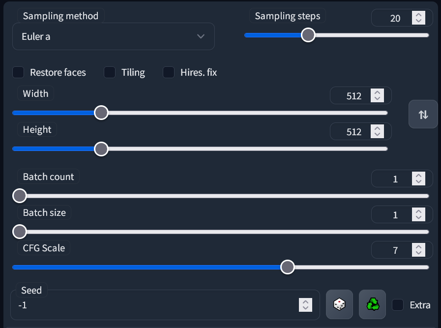

   * بخش **Sampling method**: این الگوریتم تصویر شما را فرموله میکند و هر کدام نتیجه متفاوتی ایجاد میکنند. پیش فرض `Euler a` معمولا بهترین نتیجه را دارد. همچنین نتایج خوبی را از `DPM++ 2M Karras` و `DPM++ SDE Karras` میتوانید بگیرید
   
   * بخش **Sampling steps**: اینها تعداد "محاسبات" از پیش تعیین شده را مشخص میکنند. نکته اول این است که همیشه تعداد بالاتر استپ ها به معنی جزئیات و نتیجه بهتر نیست. من معمولا از عدد 30 استفاده میکنم و شما ممکن است دوست داشتهباشید از 20 تا 50 را امتحان کنید تا مقدار مناسب خود را پیدا کنید که نتیجه دلخواه را برایتان داشته باشد.
     
   * بخش **Width** و **Height**: ابعاد پیشفرض 512در512 برای طول و عرض تصویر هستند و تقریبا میشود گفت که نباید بالاتر از 768 برای هر کدام از پارامترها بروید چون معمولا باعث خراب شدن تصویر میشود و همچنین سرعت پردازش را کاهش میدهد. برای بدست آوردن تصاویر با سایز بزرگتر به بخش `Hires fix` مراجعه کنید.
     
   * بخش **Batch Count** و **Batch Size**: بچ سایز یعنی کارت گرافیک چه تعداد تصویر را در یک زمان توید کند که محدود به میزان VRAM آن است. بچ کانت هم یعنی چندبار این فعالیت تکرار شود. بچ ها وابسته به سید هستند. توضیحات سید را در بخش `seeds`ببینید.
     
   * بخش **CFG Scale**: مقدار کمتر این پارامتر خلاقیت بیشتری در نتایج ایجاد میکند. شما تقریبا همیشه از 7 استفاده میکنید اما رنج قابل قبول از 4 تا 10 می باشد.
     
   * بخش **Seed**: یک عدد راهنما برای تولید تصاویر است. یک سید با پرامپت مشابه و پارامترهای مشابه معمولا هربار تصویر یکسانی تولید میکند، بجز در مورد بعضی جزئیات کوچک در بعضی شرایط.

   * بخش **Hires fix**: این گزینه به شما امکان تولید تصاویر بزرگتر بدون آسیب رسیدن به مراحل تولید تصویر ابتدایی را میدهد. معمولا برای بزرگ کردن دوبرابری استفاده میشود. وقتی آن را فعال کنید آپشن های بیشتری نمایان می شوند:
      * بخش **Upscaler**: الگوریتمی که بر اساس آن بزرگتر کردن ابعاد را انجام میدهد. الگوریتم `Latent` و متغیرهای آن تصاویر خلاقانه و با جزئیات ایجاد میکنند اما شاید `R-ESRGAN 4x+` را هم دوست داشته باشید، به خصوص ورژن انیمه آن را.
      * بخش **Hires steps**: توصیه میکنم که عددش را حداقل نصف مقدار sampling steps قرار دهید. مقادیر بزرگتر همیشه به معنی نتایج بهتر نیست و همچنین زمان بیشتری را برای تولید نیاز دارد، پس اینجا محافظه کارانه تصمیم بگیرید.
      * بخش **Denoising strength**: یکی از مهم ترین پارامترها است. نزدیک به 0.0 یعنی جزئیاتی به تصویر اضافه نمیشود و نزدیک به 1.0 تصویر بصورت کامل تغییر می کند. توصیه من عددی بین 0.2 و 0.6 است که البته به تصویر شما بستگی دارد که چه مقدار جزئیات به آن اضافه کند بدون اینکه جزئیات تصویر اصلی که دوست دارید از بین برود.
   
   بخش های دیگر:
   * بخش **Restore faces**: ممکن است بتواند تصاویر صورت واقع گرایانه را بهبود دهد. من هیچوقت به آن نیاز نداشته ام چون از مدل ها و پرامپت هایی که در راهنما لیست شده اند استفاده میکنم و همچنین `Hires fix` نیز کار مشابه را انجام میدهد.
   * بخش **Tiling**: برای تولید تکتچرهای تکرار شونده و قرار دادن در grid استفاده می شود.
   * بخش **Script**: به شما اجازه میدهد تا به ویژگی ها و اکستنشن های خوبی همچون [X/Y/Z Plot ▼](#plot) که برای مقایسه تصاویر با پارامترهای متغیر در گرید استفاده می شود، دسترسی داشته باشید. (مهم و قدرتمند) 
   
   
   مقایسه Sampler ها: سمپلر `Euler` یکی از سمپلرهای پایه ای است و سمپلر `DDIM` ورژن سریعتر آن است و سمپلر `DPM++ 2M Karras` ورژن بهبودیافته است. همچنین سمپلر `Euler a` یا `Euler ancestral` را داریم که بیشترین نتایج خلاقانه را تولید میکند و سمپلر `DPM++ 2S a Karras` مشابه آن است. در نهایت سمپلر `DPM++ SDE Karras` را داریم که کندترین و منحصربه فرد ترین است. تعداد زیادی سمپلر دیگر وجود دارد که به آنها نپرداخته ایم ولی کلیات آنها به همین صورت مرتبط هستند. 

&nbsp;
  
# بخش Extension ها [▲](#index) 

*استیبل دیفیوژن با رابط کاربری وب* یا *Stable Diffusion WebUI* از اضافات *extensions* که کاربردها و کیفیت های بسیار زیادی دارند پشتیبانی می کند. با مراجعه به تب **Extensions** میتوانید آنها را به برنامه اضافه کنید و با قرار دادن لینک آنها در قسمت **Install from URL** و کلیک بر روی دکمه *Install* آنها را به راحتی نصب کنید و پس از پایان نصب به قسمت **Installed** مراجعه کنید و با زدن روی دکمه *Apply and restart UI* از آنها استفاده کنید. 
تعداد محدودی اکستنشن هم هستند که برای فعال سازی نیاز به ری استارت کامل برنامه دارند و معمولا در توضیحات آنها ذکر می شود.
 
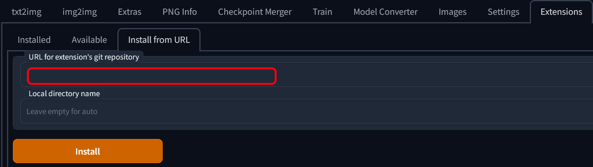

معرفی تعدادی از اکستنشن های کاربردی: اگر از کولب این راهنما استفاده میکنید تعداد زیادی از آنها را در حال حاض دارید در غیر اینصورت میتوانید آنها را خودتان اضافه کنید.
   * اکستنشن [Image Browser](https://github.com/AlUlkesh/stable-diffusion-webui-images-browser) - به شما قابلیت مرورتصاویر تولید شده قبلی را بصورت بسیار مفیدی ارائه می دهد و میتوانید مستقیما پرامپت ها و پرارامترهای استفاده شده درتصاویر را به txt2img یا img2img و دیگر بخش های مورد نیاز ارسال کنید.
   * اکستنشن [TagComplete](https://github.com/DominikDoom/a1111-sd-webui-tagcomplete) - اساسی و ضروری برای انیمه آرت است که به شما تگ های booruی منطبق را در حین تایپ کردن نشان می دهد. انیمه مدل ها با تگ های booru کار میکنند و پرامپت ها معمولا بدون آنها درست کار نمیکنند پس دانستن آنها در حد گادمود است (اطلاعات خداگونه) به خصوص اگر تگ های نایابی باشند.
   * اکستنشن [Locon](https://github.com/KohakuBlueleaf/a1111-sd-webui-locon) به شما اجازه می دهد تا از LoCon ها و LoHa ها استفاده کنید. اطلاعات بیشتر [در ادامه راهنما ▼](#lycoris) موجود است.
   * اکستنشن [ControlNet](https://github.com/Mikubill/sd-webui-controlnet) - اکستنشنی عظیم که نیاز به [راهنمای اختصاصی ▼](#controlnet) خود را دارد. این اکستنشن به شما اجازه می دهد تا آنالیز کنید و از آن برای رفرنس تصویری که میخواهید بسازید استفاده کنید. در عمل میتوانید برای هر نوع ژست/*pose* یا محیطی از آن استفاده کنید.
   * اکستنشن [Ultimate Upscale](https://github.com/Coyote-A/ultimate-upscale-for-automatic1111) - اسکریپتی کاربردی در بخش img2img برای ساخت تصاویر بسیار بزرگ است که وابسته به میزان VRAM کارت گرافیک میتوانید اندازه را بالا ببرید. توضیحات آن را [در ادامه راهنما ▼](#ultimate) میتوانید ببینید
   * اکستنشن [Two-shot](https://github.com/opparco/stable-diffusion-webui-two-shot) - معمولا نمیتوانید دو کاراکتر متفاوت در یک تصویر را بدون اینکه در هم تنیده شوند ایجاد کنید اما این اکستنشن به شما اجازه میدهد که تصویر را به قسمت های مختلفی تقسیم کنید، تمام تصویر *full*، سمت چپ *left side* و سمت راست *right side*.
   * اکستنشن [Dynamic Prompts](https://github.com/adieyal/sd-dynamic-prompts) - یک اسکریپت برای اضافه کردن المان های تصادفی به تصویر تولید شده.
   * اکستنشن [Model Converter](https://github.com/Akegarasu/sd-webui-model-converter) - برای تبدیل بیشتر مدل ها با حجم 7GB/4GB به حجم 2GB و با قابلیت انتخاب `safetensors`، `fp16` و `no-ema`. این نوع مدل های هرس شده "تقریبا همان خروجی" مدل های حجیم را ایجاد میکنند که دلیل آن محاسبات ریاضی است و مدل های جدیدتر معمولا با حجم های 2 گیگابایتی ارائه میشوند.
     

&nbsp;

# توضیحات Lora ها [▲](#index)

کلمه LoRA که مخفف *Low-Rank Adaptation* یا انطباق سطح پایین است یکی از فرم های **Extra Network** است که جدید ترین تکنولوژی برای پیوست مدل های کوچک به مدل کامل شما است. آنها شبیه *embedding* ها هستند که [قبلا ▲](#promptneg) با آن آشنا شدیم اما معمولا حجیم تر و قدرتمند تر هستند. توضیحات فنی آنها را از راهنما حذف کرده ام. 

آنها (LoRA ها) میتوانند نمایانگر یک کاراکتر، یک سبک هنری، ژست، لباس ها یا حتی صورت یک انسان باشند. چک پینت ها (مدل ها) معمولا برای کارهای عمومی خوب هستند اما وقتی میخواهیم سراغ جزئیات مشخص با مثال های موجود کم برویم، شما نیاز به یک LoRA دارید. آنها را میتوانید در [civitai](https://civitai.com) یا [جاهای دیگری (NSFW)](https://gitgud.io/gayshit/makesomefuckingporn#lora-list) پیدا و دانلود کنید و معمولا با حجم 144 مگابایت بصورت پیشفرض ارائه می شوند اما میتوانند به کوچکی 1 مگابایت هم برسند. همیشه فایل های بزرگتر به معنی نتایج بهتر نیستند. آنها با فرمت های مشابه با مدل ها ارائه می شوند پس بهتر است از فرمت `.safetensors` استفاده کنید.

فایل های مربوط به LoRA ها را در فولدر `stable-diffusion-webui/models/Lora` قرار دهید. یا اگر از کولب استفاده می کنید لینک مستقیم آنها را در باکس متنی `custom_urls` قرار دهید. بعد از آن دنبال دکمه 🎴 *Show extra networks* که زیر دکمه نارنجی رنگ بزرگ Generate است بگردید. بخش جدیدی مستقیما زیر آن یا در پایین صفحه برایتان باز می شود. بر روی تب Lora کلیک کنید و دکمه **Refresh** را بفشارید تا فایل های جدید را اسکن کند. وقتی روی یک Lora  در آن منو کلیک کنید به پرامپت موجود اضافه میشود، به این شکل: `<lora:filename:1>`. بخش ابتدایی همیشه ثابت است و بخش دوم نام فایل در سیستم بدون ذکر فرمت است و در نهایت عدد مشخص شده وزن آن را مشخص میکند که [قبلا با آن آشنا شدیم ▲](#promptweight). بیشتر Lora ها با وزن 0.5 تا 1 کار میکنند و مقدار زیاد میتواند تصویر شما را خراب کند به خصوص زمانی که همزمان از چندین Lora ی مختلف استفاده می کنید. 

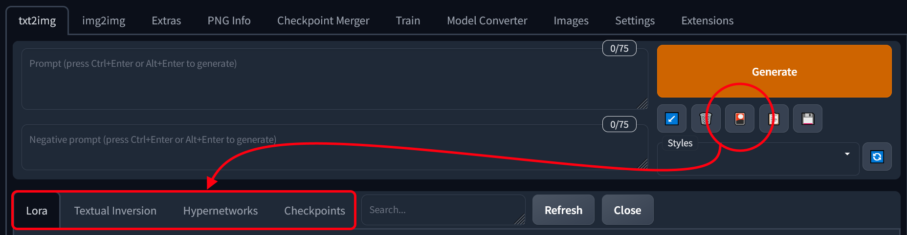

برای نمونه [Thicker Lines Anime Style](https://civitai.com/models/13910/thicker-lines-anime-style-lora-mix) یک Lora است که مناسب زمانی است که میخواهید تصویر شما بیشتر شبیه انیمه های سنتی شود.

* توضیحات Lycoris [▲](#index)

   توسعه جدیدی به نام LyCORIS انجام گرفته است که به LoRA ها اجازه میدهد درباره لایه های بیشتری یاد بگیرند. در صورت تمایل [اینجا میتوانید بیشتر در مورد آن یاد بگیرید](https://github.com/KohakuBlueleaf/Lycoris). شما به [این اکستنشن](https://github.com/KohakuBlueleaf/a1111-sd-webui-locon) برای استفاده از آنها نیاز دارید.

  فعلا دو تیپ LoRA استفاده می شود:
     * تیپ **LoCon** که گفته می شود با استایل ها *styles* خوب عمل می کند
     * تیپ **LoHa** که گفته می شود با استایل هایی که شامل کاراکتر ها هم می شوند خوب عمل می کند
 شما میتوانید لورای اختصاصی خود را پس از آشنایی با بخش [آموزش آنها ▼](#traincolab) که در ادامه راهنما آمده است بسازید.

&nbsp;

# بزرگ کردن اندازه ها/Upscaling [▲](#index)

همانطور که در [توضیحات قبلی ▲](#gen) گفته شد معمولا بهتر است که از ابعاد 768 برای طول یا عرض تصویر فراتر نروید. به جای آن از `Hires fix` و انتخاب upscaler مناسب و سطح حذف نویز (denoising level) مناسب با آن استفاده کنید تا نتایج بهتری بدست آورید. شما میتوانید upscaler های متعددی را دانلود کنید (نصب مستقیم با کولب) و در فولدر `stable-diffusion-webui/models/ESRGAN` قرار دهید. **Remacri** که در نسخه مربوط به کولب اضافه شده است یک upscaler خوب همه جانبه و عمومی است. 

   *تعداد قابل توجهی را میتوانید [ینجا پیدا کنید](https://huggingface.co/hollowstrawberry/upscalers-backup/tree/main/ESRGAN) و درصورت تمایل آنها را نصب کنید.
   *یکی از پیشرفته ترین upscaler ها که فعلا کند است LDSR می باشد. شامل فایل مدل و کانفیگ است که میتوانید [اینجا هر دو فایل را دانلود کنید](https://huggingface.co/hollowstrawberry/upscalers-backup/tree/main/LDSR) و سپس آنها را در فولدر `stable-diffusion-webui/models/LDSR` قرار دهید. 

&nbsp;

# اسکریپت ها/Scripts [▲](#index)

اسکریپت ها را در بخش پایینی پارامترهای تولید تصویر در txt2img یا img2img پیدا کنید.

* توضیحات **Plot X/Y/Z** [▲](#index)

   پلات اکس وای زی قادر به تولید، سری تصاویر که معمولا برایشان سید کاملا یکسان اما پارامترهای متغیر انتخاب کرده اید، است. تقریبا میتواند هرچیزی که بخواهید را مقایسه کند که میتواند شامل مدل های مختلف، قسمتی از پرامپت، سمپلر، آپ اسکیلر و ... باشد. میتوانید 1، 2 و یا 3 پارامتر متغیر با توجه به X، Y و Z داشته باشید. پارامترها را با کاما از هم جدا میکنیم اما هرچیزی میتواند بین آنها قرار بگیرد. بیشترین پرامپ عمومی برای مقایسه **S/R Prompt** است که اولین شرط آن جملات پرامپت خودتان است و هر شرطی بعد از آن با نسخه اصلی جایگزین میشود. با دانستن چنین موضوعی مثلا میتوانید شدت Lora را با هم مقایسه کنید. چیزی شبیه این: `<lora:my lora:0.4>, <lora:my lora:0.6>, <lora:my lora:0.8>, <lora:my lora:1>`.
  **نکته**: با استفاده از علامت کوت "نقل قول" (بدون فاصله بین علامت کوت و کاما) هم میتوانید از مقایسه S/R استفاده کنید، به این شکل: `"term 1, term 2","term 3, term 4","term 5, term 6"` 
  

* توضیحات **Prompt Matrix** [▲](#index)

  شبیه مفهوم مقایسه S/R که در بالا با آن آشنا شدیم است اما بصورت عمیق تری. عملکرد آن به این شکل است که به ما هر ترکیب شرط های قابل انجامی را که میان علامت `|` در پرامپت قرار پرفته اند را نشان می دهد. برای نمونه: در پرامپت `young man|tree|city` کلمات "young man" همیشه وجود دارند اما حالت های وجود داشتن یا وجود نداشتن "tree" و "city" را بررسی می کنیم. استفاده از کاما و فاصله در بین علامت های `|` مجاز است و مشکلی ایجاد نمیکند.
  درون اسکریپت، میتوانید انتخاب کنید که این ماتریکس روی پرامپت انجام شود یاپرامپت منفی و همچنین شرایط متغیر را برای شروع یا پایان پرامپت در نظر بگیرد.
   **نکته**: هنگام استفاده از این اسکریپت، بچ سایز به شما اجازه می دهد که تصاویر متعددی داشته باشید یا کل گرید را با هم داشته باشید. 
  

* توضیحات **Ultimate Upscaler** [▲](#index)

  یک ورژن بهینه شده از اسکریپت داخلی برنامه است که میتوان آن را بصورت [اکستنشن ▲](#extensions) نصب کرد و برای بخش **img2img** از آن استفاده کرد. هدف آن تغییر اندازه تصویر و اضافه کردن جزئیات بیشتر و گذر از محدودیت های VRAM کارت گرافیک شماست که با تقسیم کردن آنها به تکه های کوچک این کار را انجام می دهد، هرچند کند تر. روش کار:
  

  * تصویر را بصورت نرمال و تا ماکزیمم 768 پیکسل برای عرض و ارتفاع تولید کنید، و سپس می توانید گزینه hires fix را نیز اعمال کنید.
  * از بخش txt2img و یا از اکستنشن Image Browser تصویر را مستقیم به img2img منتقل کنید.
  * مقدار **Denoising** را بین 0.1 و 0.4 تنظیم کنید. اگر مقدار را بالاتر ببرید ممکن است جهش های ناخواسته ای را در نتیجه مشاهده کنید.
  * به بخش اسکریپت ها (**Scripts**) رفته و گزینه **Ultimate SD Upscale** را انتخاب کنید. سپس، پارامترهایی مشابه به این را با اندازه های مورد نظرتان را تنظیم کنید و بعد **Type** را روی **Chess** قرار دهید:

      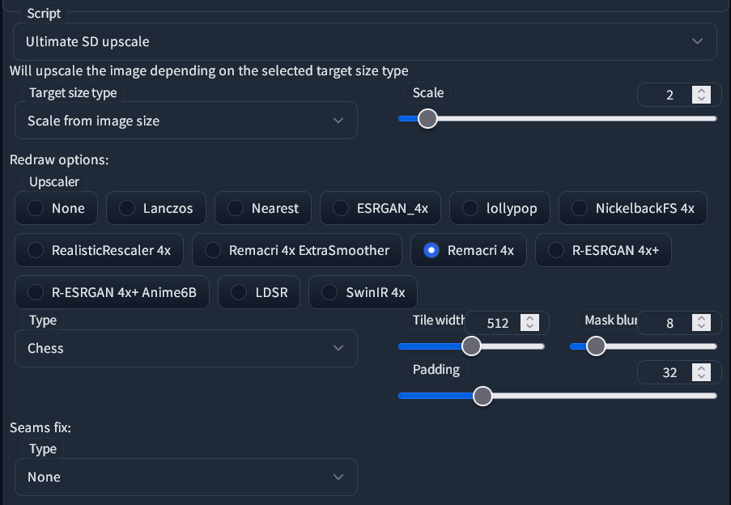

      *اگر میزان VRAM کافی دارید، ممکن است تمایل داشته باشید مقدار **Tile width** را همانند **Padding** افزایش دهید. برای مثال، هر دو را دوبرابر کنید. مقدار **Tile height** میتواند هماند 0 باشد تا با عرض هماهنگ باشد.
      * ضرورتی در تنظیم مقدار **Seams fix** نیست مگر اینکه درزهایی در بخش هایی از تصویر نهایی مشاهده شود. 
      
     
   * تولید تصویر را بزنید و منتظر بمانید. اگر پیش نمایش تصویر فعال باشد میتوانید مربع هایی که در حال شارپتر شدن هستند را ببینید.    

&nbsp;

# کنترل نت / ControlNet [▲](#index)

کنترل نت یکی از تکنولوژی های جدید و فوق العاده قدرتمند برای استیبل دیفیوژن است و به شما اجازه می دهد تا اطلاعات هر تصویری را تحلیل کنید و از آن به عنوان راهنمای تولید تصاویر برای هوش مصنوعی استفاده کنید. با هم ببینیم چطور عمل می کند:

اگر از کولب این راهنما استفاده می کنید، باید آپشن `all_control_models` را فعال کنید، در غیر اینصورت ابتدا نیاز است که [اکستنشن ▲](#extensions) ControlNet را نصب کنید، سپس به [این لینک بروید](https://huggingface.co/webui/ControlNet-modules-safetensors/tree/main) تا تعدادی مدل دانلود کنید و آنها را در فولدر `stable-diffusion-webui/extensions/sd-webui-controlnet/models` قرار دهید. توصیه میکنم حداقل Canny, Depth, Openpose و Scribble را دانلود کنید. 
به شما نشان می دهم که کنترل نت چطور عمل میکند. برای این منظور از تصویر محبوب اینترنتی برای "sample image" خود استفاده می کنیم. 
ابتدا، در صفحه txt2img اسکرول کنید و روی ControlNet کلیک کنید تا منویش باز شود. بعد روی *Enable* کلیک کنید و یک *preprocessor* و *model* هماهنگ را برگزینید. در شروع Canny را برای هر دو انتخاب میکنم. و در نهایت تصویر نمونه را آپلود میکنم. مراقبم که روی تصویر نمونه کلیک نکنم چون شروع به ترسیم میکند. و میتوانم از بقیه تنظیمات صرفنظر کنم.

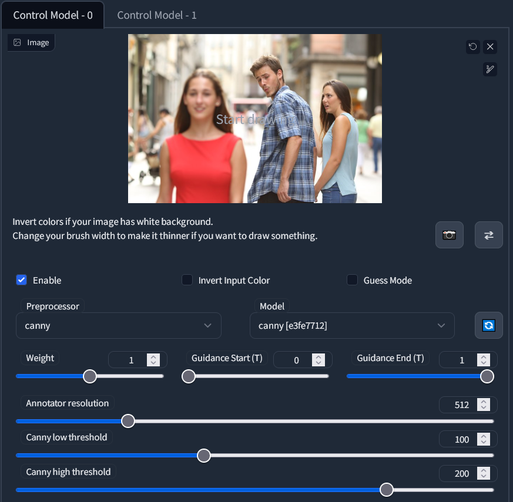

* متد **Canny**

   این متد لبه های تیز را از تصویر نمونه استخراج میکند و در موارد بسیار متفاوتی از تصاویر کاربرد دارد، به خصوص زمانی که میخواهید جزیاتی کوچک را حفظ کنید و همچنین حالت کلی تصویر را داشته باشید. مشاهده نمایید: 
   
   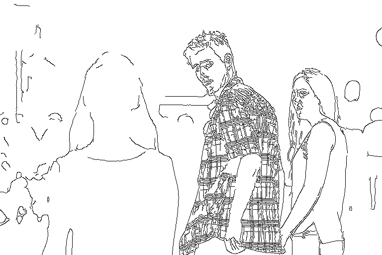
   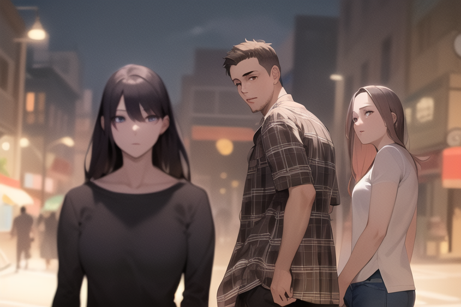

* متد **Depth**

   این متد المانهای سه بعدی در تصویر نمونه را استخراج میکند و برای محیط های پیچیده و همچنین کامپوزیشن های عمومی مناسب است. مشاهده نمایید:
   
   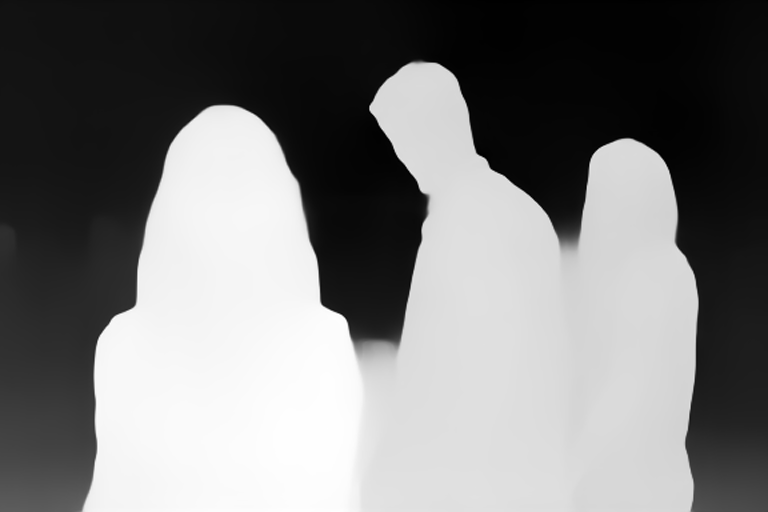
   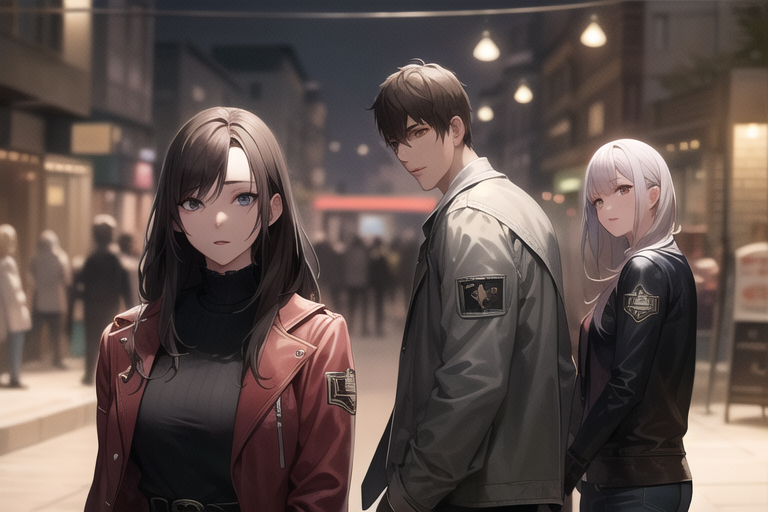

* متد **Openpose**

   این متد پوزهای (ژست های) انسان را در تصویر نمونه استخراج میکند و به شکل فوق العاده ای به کامپوزیشن کاراکتری که تولید کرده اید برای شات مورد نظرتان کمک میکند. مشاهده نمایید: 
   
   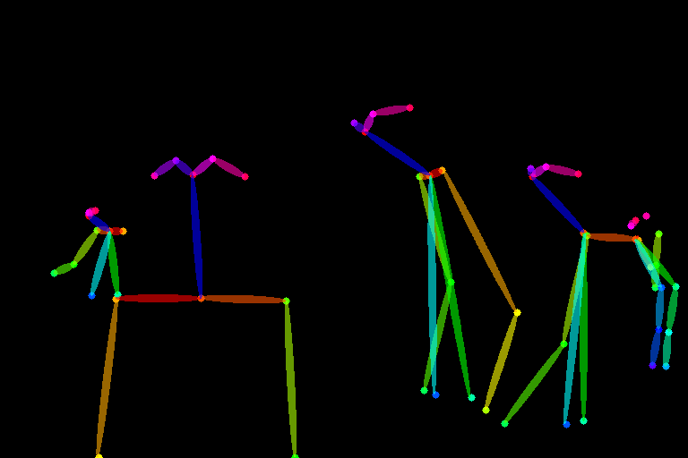
   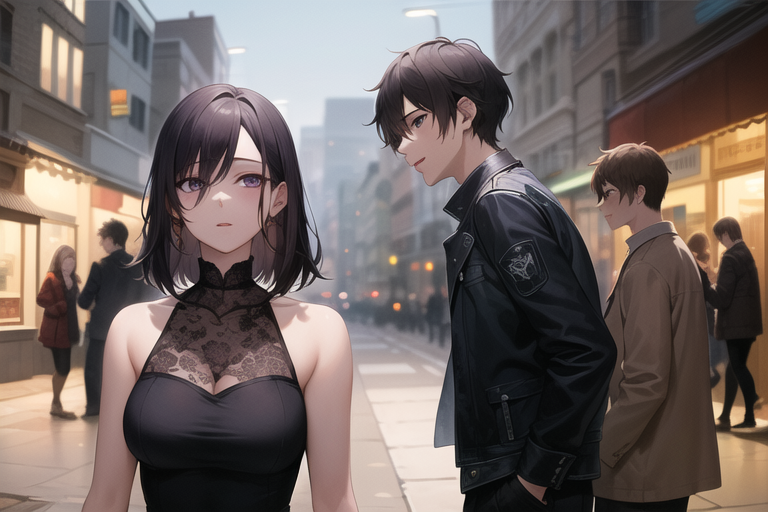

* متد**Scribble**

   به شما اجازه میدهد که یک اسکچ ساده را با کمک پرامپی که نوشته اید به یک تصویر نهایی تبدیل کنید. این تنها مثالی است که از تصویر نمونه بالا استفاده نمیکند. مشاهده نمایید: 
   
   
   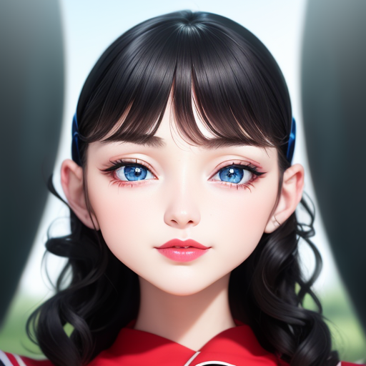
  
همانطور که متوجه شده اید برای همه متدها بجز Scribble، دو نتیجه به وجود می آید. اولین آن intermediate step یا قدم واسطه ایست و *preprocessed image* را فراخوانی میکند که سپس از آن برای تولید تصویر نهایی استفاده می شود. شما میتوانید این تصویر را خودتان به هوش مصنوعی بدهید که در اینصورت باید تنظیم preprocessor را روی *None* قرار دهید. اگر این را با ابزارهای گرافیکی همانند Blender و Photoshop ترکیب کنید به ابزاری فوق العاده قدرتمند تبدیل می شود.

در تب تنظمات (Settings) سکشن ControlNet وجد دارد که میتوانید حالت *multiple controlnets at once* را در آن فعال کنید. یک کاربرد منحصرا خوب برای آن زمانی است که میخواهید از Openpose برای ژست ویژه کاراکتر خود در محیط ویژه موردنظرتان استفاده کنید یا وقتی حالت ویژه ای را برای دست در نظر دارید یا جزئیات خاصی می خواهید. میتوانید آن را با ترکیب Openpose+Canny امتحان کنید.

همچنین میتوانید از کنترل نت در img2img استفاده کنید که هردو تصویر نمونه و تصویر ورودی تاثیر قطعی بر نتیجه خواهند داشت. 

جایگزین های مختلفی برای هر مدل کنترل نتی هم وجود دارد که در صورت تمایل میتوانید آنها را [اینجا امتحان کنید](https://civitai.com/models/9868/controlnet-pre-trained-difference-models)، البته خودم آنها را امتحان نکرده ام.

&nbsp;

# Lora Training for beginners [▲](#index)

To train a [Lora ▲](#lora) is regarded as a difficult task. However, my new guide covers everything you need to know to get started for free, thanks to Google Colab:

**[🎴 Read my Lora making guide here](https://civitai.com/models/22530)**

You can also train a Lora on your own computer if you have at least 8 GB of VRAM. For that, I will list a few resources below:

* For training, use [bmaltais' Kohya GUI](https://github.com/bmaltais/kohya_ss). It has all the same settings as my trainer colab and more, so you can follow my guide too. Also there are youtube tutorials available in this link.
* Also, here's an [angry Lora training guide by ao](https://rentry.org/tohoaifaq#opinionated-lora-guide-for-colab)
* To collect your images from Gelbooru like in my guide, install [Grabber](https://github.com/Bionus/imgbrd-grabber/releases).
* To tag your dataset use the [WD1.4 Tagger extension](https://github.com/toriato/stable-diffusion-webui-wd14-tagger) for webui. First add and enable the extension, and restart your entire webui. Then go to the new **Tagger** tab, then **Batch from directory**, and select the folder with your images. Set the output name to `[name].txt` and the threshold at or above 0.35 (this is how closely each tag must match an image to be included). Then **Interrogate** and it will start generating your text files.
* To curate your tags like in my guide use the [Tag Editor extension](https://github.com/toshiaki1729/stable-diffusion-webui-dataset-tag-editor) for webui. It has all the features you need like sorting, pruning, replacing and merging tags. To add an activation tag it's as follows: After adding the extension and restarting your webui, go to the new **Dataset Tag Editor** tab then **Batch Edit Captions**. Turn off "*Show only the tags...*", turn on "*Prepend additional tags*", then add your activation tag inside the **Edit Tags** text box. Then apply your changes, scroll up and save your changes. Only then will it modify your files and add a new tag at the beginning of every text file.

&nbsp;

# ...vtubers? [▲](#index)

That's it, that's the end of this guide for now. I'd be grateful if you want to contribute on missing topics like:
* img2img
* Inpainting
* Controlnet t2i adapters

Thank you for reading!

I have [a separate repo that aggregates vtuber Loras, specially Hololive](https://huggingface.co/hollowstrawberry/holotard). If you're interested in that.

Cheers.

&nbsp;
