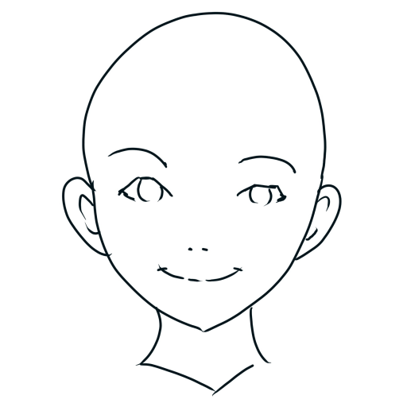
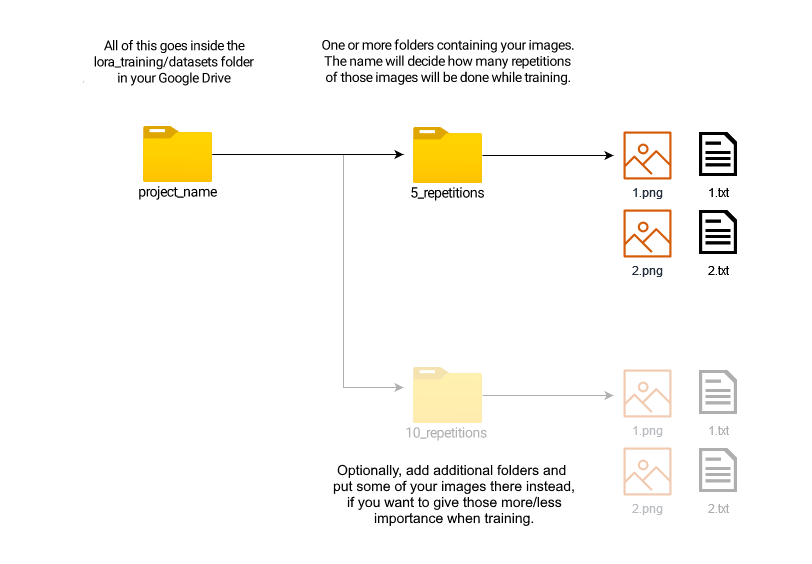

**[⭐ CLICK HERE TO OPEN THIS DOCUMENT IN FULL WIDTH](README.md#index)**  
**(The index won't work otherwise).**

[🇪🇸🇲🇽 HAZ CLICK AQUÍ PARA VER ESTA GUÍA EN ESPAÑOL](spanish.md#index)

&nbsp;

# Index 

* [Introduction](#intro)
* [Google Collab](#collab)
* [Local Installation (Windows + Nvidia)](#install)
* [Getting Started](#start)
   1. [Models](#model)
   1. [VAEs](#vae)
   1. [Prompts](#prompt)
   1. [Generation parameters](#gen)
* [Extensions](#extensions)
* [Loras](#lora)
* [Upscaling](#upscale)
* [Scripts](#imgscripts)
   * [X/Y/Z Plot](#plot)
   * [Prompt Matrix](#matrix)
   * [Ultimate Upscaler](#ultimate)
* [ControlNet](#controlnet)
* [Lora Training for beginners](#train)
    * [Creating a dataset](#datasets)
    * [Training Parameters](#trainparams)
    * [Testing your results](#traintest)
    * [Additional tips](#trainchars)
* [...vtubers?](#vtubers)
 
&nbsp;

# Introduction [▲](#index)

Stable Diffusion is a very powerful AI image generation software you can run on your own home computer. It uses "models" which function like the brain of the AI, and can make almost anything, given that someone has trained it to do it. The biggest uses are anime art, photorealism, and NSFW content.

The images you create may be used for any purpose, depending on the used model's license. Whether they are "yours" in a legal sense varies by local laws and is often inconclusive. Neither I or any of the people involved in Stable Diffusion or its models are responsible for anything you make, and you are expressively forbidden from creating illegal or harmful content.

This guide is up to date with the best practices as of March 2023. One week is like a year in AI time, so hopefully it is still useful by the time you read it.

&nbsp;

# Google Collab [▲](#index)

The easiest way to use Stable Diffusion is through Google Collab. It borrows Google's computers to use AI, with variable time limitations, usually a few hours every day. You will need at least one Google account and we will be using Google Drive to store your settings and resulting images.

If you instead want to run it on your own computer, [scroll down ▼](#install).

1. Open [THIS PAGE](https://colab.research.google.com/drive/1wEa-tS10h4LlDykd87TF5zzpXIIQoCmq).

1. Near the top, click **Copy to Drive**. Wait for the new window to open and close the old one. This is now your personalized collab which will save your settings, and you should open it from your Google Drive from now on. If the original receives an update you'll have to replace yours to benefit from it.

1. Turn on the following options under **Configurations**: `output_to_drive, configs_in_drive, no_custom_theme`. Then, turn on the following options under **Models, VAEs, etc**: `anything_vae`, `wd_vae`, `sd_vae`.

1. If you're already familiar with Stable Diffusion, you may paste links to your desired resources in the `custom_urls` text box. We will add some links later in this guide. Links must be **direct downloads** to each file (ideally from civitai or huggingface), and must be separated by commas.

1. Press the play button to the left, anywhere in the first section of the page labeled **Start 🚀**. Wait a few minutes for it to finish, while a few progress messages appear near the bottom. Then, a **public link** will be created, which you can open in a new tab to start using Stable Diffusion. **Keep the collab tab open!** (It may be difficult to keep both tabs open on mobile)

1. You can now make some decent anime images thanks to the default **Anything 4.5** model. But we can do more. Also, what are all of these options? [Scroll down ▼](#start) to get started.

&nbsp;

# Local Installation (Windows + Nvidia) [▲](#index)

To run Stable Diffusion on your own computer you'll need at least 16 GB of RAM and 4 GB of VRAM (preferably 8). I will only cover the case where you are running Windows 10/11 and using an NVIDIA graphics card series 16XX, 20XX or 30XX (though 10XX also work). My apologies to AMD, Linux, and Mac users, but their cases are harder to cover. If you don't meet the hardware requirements, you can just proceed with the Google Collab method [above ▲](#collab).

1. Get the latest release from [this page](https://github.com/EmpireMediaScience/A1111-Web-UI-Installer/releases). 

1. Run the installer, choose an easy and accessible location to install to, and wait for it to finish.

1. Run the program. You will see a few options. First, turn on **medvram** and **xformers**. You may skip medvram if you have 12 or more GB of VRAM.

1. Set your **Additional Launch Options** to: `--opt-channelslast --no-half-vae --theme dark` . Any extra options should be separated by spaces.
    * If your graphics card has 4-6 GB of VRAM, add `--opt-split-attention-v1` as it may lower vram usage even further.
    * If you want to run the program from your computer but want to use it in another device, such as your phone, add `--listen --enable-insecure-extension-access` . After launching, use your computer's local IP in the same WiFi network to access the interface. You can also add a password like `--gradio-auth name:1234` .
    * Full list of possible parameters [here](https://github.com/AUTOMATIC1111/stable-diffusion-webui/wiki/Command-Line-Arguments-and-Settings)

1. Click **Launch** and wait for a browser window to open with the interface. It may take a while the first time.

1. The page is now open. It's your own private website. The starting page is where you can make your images. But first, we'll go to the **Settings** tab. There will be sections of settings on the left.
    * In the *Stable Diffusion* section, scroll down and increase **Clip Skip** from 1 to 2. This is said to produce better images, specially for anime.
    * In the *User Interface* section, scroll down to **Quicksettings list** and change it to `sd_model_checkpoint, sd_vae`
    * Scroll back up, click the big orange **Apply settings** button, then **Reload UI** next to it.

1. You are more than ready to generate some images, but you only have the basic model available. It's not great, at most it can make some paintings. Also, what are all of these options? See [below ▼](#start) to get started.

&nbsp;

# Getting Started [▲](#index)

Before or after generating your first few images, you will want to take a look at the information below to improve your experience and results.  
If you followed the instructions above, the top of your page should look similar to this:

Here you can select your checkpoint and VAE. We will go over what these are and how you can get some. The collab has additional settings here too, you should ignore them for now.

1. **Models** [▲](#index)

   The **model**, also called **checkpoint**, is the brain of your AI, designed for the purpose of producing certain types of images. There are many options, most of which are on [civitai](https://civitai.com). But which to choose? These are my recommendations:
   * For anime, [7th Heaven Mix](https://civitai.com/models/4669/corneos-7th-heaven-mix) has a nice aesthetic similar to anime movies, while [Abyss Orange Mix 3](https://civitai.com/models/9942/abyssorangemix3-aom3) *(__Note:__ scroll down there and choose the AOM3 option)* offers more realism in the form of advanced lighting and softer shading, as well as more lewdness. I merged these two options into [Heaven Orange Mix](https://civitai.com/models/14305/heavenorangemix).
   * While AOM3 is extremely capable for NSFW, the popular [Grapefruit](https://civitai.com/models/2583/grapefruit-hentai-model) hentai model may also fit your needs.
   * For general art go with [DreamShaper](https://civitai.com/models/4384/dreamshaper), there are few options quite like it in terms of creativity. An honorable mention goes to [Pastel Mix](https://civitai.com/models/5414/pastel-mix-stylized-anime-model), which has a beautiful and unique aesthetic with the addition of anime.
   * For photorealism go with [Deliberate](https://civitai.com/models/4823/deliberate). It can do almost anything, but specially photographs. Very intricate results.
   * The [Uber Realistic Porn Merge](https://civitai.com/models/2661/uber-realistic-porn-merge-urpm) is self-explanatory.

   If you're using the collab in this guide, copy the **direct download link to the file** and paste it in the text box labeled `custom_urls`. Multiple links are separated by commas.

   If you're running the program locally, the models normally go into the `stable-diffusion-webui/models/Stable-diffusion` folder.

   Please note that checkpoints in the format `.safetensors` are safe to use while `.ckpt` **may** contain viruses, so be careful. Additionally, when choosing models you may have a choice between fp32, fp16 and pruned. They all produce the same images within a tiny margin of error, so just go with the smallest file (pruned-fp16). If you want to use them for training or merging, go with the largest one instead.

   **Tip:** Whenever you place a new file manually you can either restart the UI at the bottom of the page or press the small 🔃 button next to its dropdown.

1. **VAEs** [▲](#index)

   Most checkpoints don't come with a VAE built in. The VAE is a small separate model, which "converts your image into human format". Without it, you'll get faded colors and ugly eyes, among other things.

   If you're using the collab in this guide, you should already have the below VAEs, as I told you to select them before running.

   There are practically only 3 different VAEs in circulation:
   * [anything vae](https://huggingface.co/WarriorMama777/OrangeMixs/resolve/main/VAEs/orangemix.vae.pt), also known as the orangemix vae. All anime models use this.
   * [vae-ft-mse](https://huggingface.co/stabilityai/sd-vae-ft-mse-original/blob/main/vae-ft-mse-840000-ema-pruned.safetensors), the latest from Stable Diffusion itself. Used by photorealism models and such.
   * [kl-f8-anime2](https://huggingface.co/hakurei/waifu-diffusion-v1-4/resolve/main/vae/kl-f8-anime2.ckpt), also known as the Waifu Diffusion VAE, it is older and produces more saturated results. Used by Pastel Mix.

   The VAEs normally go into the `stable-diffusion-webui/models/VAE` folder.
   
   If you did not follow this guide up to this point, you will have to go into the **Settings** tab, then the **Stable Difussion** section, to select your VAE.

   **Tip:** Whenever you place a new file manually you can either restart the UI at the bottom of the page or press the small 🔃 button next to its dropdown.

1. **Prompts** [▲](#index)

   On the first tab, **txt2img**, you'll be making most of your images. This is where you'll find your *prompt* and *negative prompt*.  
   Stable Diffusion is not like Midjourney or other popular image generation software, you can't just ask it what you want. You have to be specific. *Very* specific.  
   Most people have found a prompt that works for them and they swear by it, often recommended by other people. I will show you my own personal example of a prompt and negative prompt:
   
   * Anime
      * `2d, masterpiece, best quality, anime, highly detailed face, highly detailed eyes, highly detailed background, perfect lighting`
      * `EasyNegative, worst quality, low quality, 3d, realistic, photorealistic, (loli, child, teen, baby face), zombie, animal, multiple views, text, watermark, signature, artist name, artist logo, censored`
     
   * Photorealism
      * `best quality, 4k, 8k, ultra highres, photorealistic, RAW photo, hdr, sharp focus, intricate texture, skin imperfections`
      * `EasyNegative, worst quality, low quality, normal quality, child, painting, drawing, sketch, cartoon, anime, render, 3d, blurry, deformed, disfigured, morbid, mutated, bad anatomy, bad art`

   * **EasyNegative:** The negative prompts above use EasyNegative, which is an *embedding* or "magic word" that encodes many bad things to make your images better. Otherwise you'd have to use a huge negative prompt.
      * If you're using the collab in this guide you already have this installed. Otherwise, you will have to [download this tiny file](https://huggingface.co/datasets/gsdf/EasyNegative/resolve/main/EasyNegative.safetensors), put it in your `stable-diffusion-webui/embeddings` folder, then go to the bottom of your WebUI page and click *Reload UI*. It will then work when you type that word.

   A comparison with and without these negative prompts including EasyNegative can be seen [further down ▼](#matrixneg).

   

   After a "base prompt" like the above, you may then start typing what you want. For example `young woman in a bikini in the beach, full body shot`. Feel free to add other terms you don't like to your negatives such as `old, ugly, futanari, furry`, etc.  
   You can also save your prompts to reuse later with the buttons below Generate. Click the small 💾 *Save style* button and give it a name. Later, you can open your *Styles* dropdown to choose, then click 📋 *Apply selected styles to the current prompt*.

   One important technique when writing prompts are emphasis and de-emphasis. When you surround something in `(parentheses)`, it will get more emphasis or **weight** in your resulting image, basically telling the AI that part is more important. The normal weight for every word is 1, and each parentheses will multiply by 1.1 (you can use multiple). You can also specify the weight yourself, like this: `(full body:1.4)`. You can also go below 1 to de-emphasize a word: `[brackets]` will multiply by 0.9, but you'll still need parentheses to go lower, like `(this:0.5)`.

   Also note that hands and feet are famously difficult for AI to generate. These methods improve your chances, but you may need to do photoshopping, inpainting, or advanced techniques with [ControlNet ▼](#controlnet) to get it right.

1. **Generation parameters** [▲](#index)

   The rest of the parameters in the starting page will look something like this:
   
   

   * **Sampling method:** This is the algorithm that formulates your image, and each produce different results. The default of `Euler a` is often the best. There are also very good results for `DPM++ 2M Karras` and `DPM++ SDE Karras`. See below for a comparison.
   * **Sampling steps:** These are "calculated" beforehand, and so more steps doesn't always mean more detail. I always go with 30, you may go from 20-50 and find consistently good results. See below for a comparison.
   * **Width and Height:** 512x512 is the default, and you should almost never go above 768 in either direction as it may distort and deform your image. To produce bigger images see `Hires fix`.
   * **Batch Count and Batch Size:** Batch *size* is how many images your graphics card will generate at the same time, which is limited by its VRAM. Batch *count* is how many times to repeat those. Batches have consecutive seeds, more on seeds below.
   * **CFG Scale:** "Lower values produce more creative results". You should almost always stick to 7, but 4 to 10 is an acceptable range.
   * **Seed:** A number that guides the creation of your image. The same seed with the same prompt and parameters produces the same image every time, except for small details and under some circumstances.
  
   **Hires fix:** Lets you create larger images without distortion. Often used at 2x scale. When selected, more options appear:
   * **Upscaler:** The algorithm to upscale with. `Latent` and its variations produce creative and detailed results, but you may also like `R-ESRGAN 4x+` and its anime version. [More explanation and some comparisons further down ▼](#upscale). 
   * **Hires steps:** I recommend at least half as many as your sampling steps. Higher values aren't always better, and they take a long time, so be conservative here.
   * **Denoising strength:** The most important parameter. Near 0.0, no detail will be added to the image. Near 1.0, the image will be changed completely. I recommend something between 0.2 and 0.6 depending on the image, to add enough detail as the image gets larger, without *destroying* any original details you like.
    
   Others:
   * **Restore faces:** May improve realistic faces. I never need it with the models and prompts listed in this guide as well as hires fix.
   * **Tiling:** Used to produce repeating textures to put on a grid. Not very useful.
   * **Script:** Lets you access useful features and extensions, such as [X/Y/Z Plot ▼](#plot) which lets you compare images with varying parameters on a grid. Very powerful.

   Here is a comparison of a few popular samplers and various sampling steps:

   

      
(Click) Sampler comparison - Photography

      
   

   

      
(Click) Sampler comparison - Anime

      
   

   An explanation of the samplers used above: `Euler` is a basic sampler. `DDIM` is a faster version, while `DPM++ 2M Karras` is an improved version. Meanwhile we have `Euler a` or "ancestral" which produces more creative results, and `DPM++ 2S a Karras` which is also ancestral and thus similar. Finally `DPM++ SDE Karras` is the slowest and quite unique. There are many other samplers not shown here but most of them are related.

&nbsp;
  
# Extensions [▲](#index)

*Stable Diffusion WebUI* supports extensions to add additional functionality and quality of life. These can be added by going into the **Extensions** tab, then **Install from URL**, and pasting the links found here or elsewhere. Then, click *Install* and wait for it to finish. Then, go to **Installed** and click *Apply and restart UI*.
 

Here are some useful extensions. If you're using the collab in this guide you already have most of these, otherwise I hugely recommend you manually add the first 2:
* [Image Browser (fixed fork)](https://github.com/aka7774/sd_images_browser) - This will let you browse your past generated images very efficiently, as well as directly sending their prompts and parameters back to txt2img, img2img, etc.
* [TagComplete](https://github.com/DominikDoom/a1111-sd-webui-tagcomplete) - Absolutely essential for anime art. It will show you the matching booru tags as you type. Anime models work via booru tags, and prompts without them usually don't work, so knowing them is godmode. Not all tags will work well in all models though, specially if they're rare.
* [ControlNet](https://github.com/Mikubill/sd-webui-controlnet) - A huge extension deserving of [its own guide ▼](#controlnet). It lets you analyze any image and use it as an referene for your own image. Practically speaking, it can create any pose or environment you want.
* [Ultimate Upscale](https://github.com/Coyote-A/ultimate-upscale-for-automatic1111) - A script usable from the img2img section to make really large images, where normally you can only go as high as your VRAM allows. See [Ultimate Upscaler ▼](#ultimate).
* [Two-shot](https://github.com/opparco/stable-diffusion-webui-two-shot) - Normally you can't create more than one distinct character in the same image without them blending together. This extension lets you divide the image into parts; full, left side, right side; allowing you to make nice 2-character images.
* [Dynamic Prompts](https://github.com/adieyal/sd-dynamic-prompts) - A script to let you generate randomly chosen elements in your image, among other things.
* [Model Converter](https://github.com/Akegarasu/sd-webui-model-converter) - Lets you convert most 7GB/4GB models down to 2GB, by choosing `safetensors`, `fp16`, and `no-ema`. These pruned models work "almost the same" as the full models, which is to say, there is no appreciable difference due to math reasons. Most models come in 2 GB form nowadays regardless.

&nbsp;

# Loras [▲](#index)

LoRA or *Low-Rank Adaptation* is a form of **Extra Network** and the latest technology that lets you append a sort of smaller model to any of your full models. They are similar to embeddings, one of which you might've seen [earlier ▲](#promptneg), but Loras are larger and often more capable. Technical details omitted.

Loras can represent a character, an artstyle, poses, clothes, or even a human face (though I do not endorse this). Checkpoints are usually capable enough for general work, but when it comes to specific details with little existing examples, you'll need a Lora. They can be downloaded from [civitai](https://civitai.com) or [elsewhere (NSFW)](https://gitgud.io/gayshit/makesomefuckingporn#lora-list) and are 144 MB by default, but they can go as low as 1 MB. Bigger Loras are not always better. They come in `.safetensors` format, same as most checkpoints.

Place your Lora files in the `stable-diffusion-webui/models/Lora` folder, or if you're using the collab in this guide paste the direct download link into the `custom_urls` text box. Then, look for the 🎴 *Show extra networks* button below the big orange Generate button. It will open a new section either directly below or at the very bottom. Click on the Lora tab and press the **Refresh** button to scan for new Loras. When you click a Lora in that menu it will get added to your prompt, looking like this: `<lora:filename:1>`. The start is always the same. The filename will be the exact filename in your system without the `.safetensors` extension. Finally, the number is the weight, like we saw [earlier ▲](#promptweight). Most Loras work between 0.5 and 1 weight, and too high values might "fry" your image, specially if using multiple Loras at the same time.

An example of a Lora is [Thicker Lines Anime Style](https://civitai.com/models/13910/thicker-lines-anime-style-lora-mix), which is perfect if you want your images to look more like traditional anime.

&nbsp;

# Upscaling [▲](#index)

As mentioned in [Generation Parameters ▲](#gen), normally you shouldn't go above 768 width or height when generating an image. Instead you should use `Hires fix` with your choice of upscaler and an appropiate denoising level. Hires fix is limited by your VRAM however, so you may be interested in [Ultimate Upscaler ▼](#ultimate) to go even larger.

You can download additional upscalers and put them in your `stable-diffusion-webui/models/ESRGAN` folder. They will then be available in Hires fix, Ultimate Upscaler, and Extras.

The collab in this guide comes with several of them, including **Remacri**, which is a great all-around upscaler for all sorts of images.

* A few notable ones can be [found here](https://huggingface.co/hollowstrawberry/upscalers-backup/tree/main/ESRGAN).
* LDSR is an advanced yet slow upscaler, its model and config can be [found here](https://huggingface.co/hollowstrawberry/upscalers-backup/tree/main/LDSR) and both must be placed in `stable-diffusion-webui/models/LDSR`.
* The [Upscale Wiki](https://upscale.wiki/wiki/Model_Database) contains dozens of historical choices.

Here are some comparisons. All of them were done at 0.4 denoising strength. Note that some of the differences may be completely up to random chance.

(Click) Comparison 1: Anime, stylized, fantasy

   **Some details to consider:** The fireballs to the left and right, the texture of the fire around her, the grass and its flowers, the ghost's face, the flowers in her hat, the hands, the eyes (which should be flower-shaped), the things on her waist.

   

   

   **My personal impression (please ignore):** It's clear that the Latent options offer the most detail, perhaps too much if this piece is supposed to be stylized. Latent Nearest Exact catches my eye the most because of the background and the ghost's face, but Anime6B has some nice flowers which I asked for, and lollypop has my favorite fire texture. Remacri is somewhere in the middle for all of them to me, but not its smoother variant.

(Click) Comparison 2: Anime, detailed, soft lighting

   **Some details to consider:** The background, the flower and symbol on her hat, the flowers on the branches to the sides, the eyes (which should be flower-shaped), the emblem below her neck, The pattern on the lower half of her dress, as well as the nearby frills and folds.
   
   

   

   **My personal impression (please ignore):** Latent made everything blurry while Latent Nearest Exact again has the most detail. Anime6B got the best eyes. Lollypop and Remacri (not smoother) both have nice flowers. It's a hard pick.

(Click) Comparison 3: Photography, human, nature

   **Some details to consider:** The eye on the left, the finger creases, the bracelet, the edge trim on the vest, the flower on the vest, the brooches on the vest, the rocks and vegetation on the bottom left, the trees on the top left, the waterfalls of course.
   
   

   

   **My personal impression (please ignore):** Because of the eye discoloration and the vest's trim I would go with Latent Nearest Exact, but RealisticRescaler has the best vegetation detail, and NickelbackFS feels the best pronounced. The others are all quite alright.

&nbsp;

# Scripts [▲](#index)

Scripts can be found at the bottom of your generation parameters in txt2img or img2img.

* **X/Y/Z Plot** [▲](#index)

   Capable of generating a series of images, usually with the exact same seed, but varying parameters of your choice. Can compare almost anything you want, including different models, parts of your prompt, sampler, upscaler and much more. You can have 1, 2, or 3 variable parameters, hence the X, Y and Z.

   Your parameters in X/Y/Z Plot are separated by commas, but anything else can go inbetween. The most common parameter to compare is **S/R Prompt**, where the first term is a phrase in your prompt and each term afterwards will replace the original. Knowing this, you can compare, say, Lora intensity, like this:

   `<lora:my lora:0.4>, <lora:my lora:0.6>, <lora:my lora:0.8>, <lora:my lora:1>`

   Here I made a comparison between different **models** (columns) and faces of different ethnicities via **S/R Prompt** (rows):

   

   
(Click) X/Y/Z Plot example

   
   
   

   **Tip:** It appears possible to do S/R with commas by using quotes like this (note no spaces between the commas and quotes): `"term 1, term 2","term 3, term 4","term 5, term 6"`

* **Prompt Matrix** [▲](#index)

   Similar conceptually to S/R from before, but more in-depth. It works by showing each possible combination of terms listed between the `|` symbol in your prompt, for example: `young man|tree|city` will always contain "young man", but we'll see what happens when we add or remove "tree" and "city". You can use commas and spaces just fine between the `|`.

   Inside the script, you will choose either your prompt or your negative prompt to make a matrix of, and whether the variable terms should be put at the start or the end.

   Here is a comparison using the negative prompts I showed you in [Prompts ▲](#prompt). We can see how EasyNegative affects the image, as well as how the rest of the prompt affects the image, then both together:

   

   
(Click) Prompt matrix examples

  
   
   
   

   **Tip:** When using prompt matrix, the Batch Size will let you generate multiple images or the whole grid all at once.

* **Ultimate Upscaler** [▲](#index)

   An improved version of a builtin script, it can be added as an [extension ▲](#extensions) and used from within **img2img**. Its purpose is to resize an image and add more detail way past the normal limits of your VRAM by splitting it into chunks, although slower. Here are the steps:

   1. Generate your image normally up to 768 width and height, you can then apply hires fix if you are able to.

   1. From txt2img or the Image Browser extension send it directly into img2img, carrying its prompt and parameters.

   1. Set the **Denoising** somewhere between 0.1 and 0.4. If you go higher you most likely will experience mutations.

   1. Go down to **Scripts** and choose **Ultimate SD Upscale**. Then, set your parameters like this, with your desired size and upscaler, and the **"Chess" Type**:
   
      

      * If you have enough VRAM, you may increase the **Tile width** as well as the **Padding**. For example, doubling both of them. **Tile height** can remain at 0 and it'll match the width.
     
      * It is not necessary to set the **Seams fix** unless you encounter visible seams between regions in the final image.
     
   1. Generate your image and wait. You can watch the squares get sharper if you have image previews enabled.

&nbsp;

# ControlNet [▲](#index)

ControlNet is an extremely powerful recent technology for Stable Diffusion. It lets you analyze information about any previously existing image and use it to guide the generation of your AI images. We'll see what this means in a moment.

If you're using the collab in this guide, you should enable the `all_control_models` option. Otherwise, you should first install the ControlNet [extension ▲](#extensions), then go [here](https://civitai.com/models/9251/controlnet-pre-trained-models) to download some models which you'll need to place in `stable-diffusion-webui/extensions/sd-webui-controlnet/models`. I recommend at least Canny, Depth, Openpose and Scribble, which I will show here.

I will demonstrate how ControlNet may be used. For this I chose a popular image online as our "sample image". It's not necessary for you to follow along, but you can download the images and put them in the **PNG Info** tab to view their generation data.

First, you must scroll down in the txt2img page and click on ControlNet to open the menu. Then, click *Enable*, and pick a matching *preprocessor* and *model*. To start with, I chose Canny for both. Finally I upload my sample image. Make sure not to click over the sample image or it will start drawing. We can ignore the other settings.

* **Canny**

   The Canny method extracts the hard edges of the sample image. It is useful for many different types of images, specially where you want to preserve small details and the general look of an image. Observe:

   

   
(Click) Canny example

   
   
   
   

* **Depth**

   The Depth method extracts the 3D elements of the sample image. It is best suited for complex environments and general composition. Observe:

   

   
(Click) Depth example

   
   
   
   

* **Openpose**

   The Openpose method extracts the human poses of the sample image. It helps tremendously to get the desired shot and composition of your generated characters. Observe:

   

   
(Click) Openpose example

   
   
   
   

* **Scribble**

   Lets you make a simple sketch and convert it into a finished piece with the help of your prompt. This is the only example not using the sample image above.

   

   
(Click) Scribble example

   
   
   
   

You will notice that there are 2 results for each method except Scribble. The first is an intermediate step called the *preprocessed image*, which is then used to produce the final image. You can supply the preprocessed image yourself, in which case you should set the preprocessor to *None*. This is extremely powerful with external tools such as Blender and Photoshop.

In the Settings tab there is a ControlNet section where you can enable *multiple controlnets at once*. One particularly good use is when one of them is Openpose, to get a specific character pose in a specific environment, or with specific hand gestures or details. Observe:

(Click) Openpose+Canny example

You can also use ControlNet in img2img, in which the input image and sample image both will have a certain effect on the result. I do not have much experience with this method.

There are also alternative **diff** versions of each ControlNet model, which produce slightly different results. You can [try them](https://civitai.com/models/9868/controlnet-pre-trained-difference-models) if you want, but I personally haven't.

&nbsp;

# Lora Training for beginners [▲](#index)

To train a [Lora ▲](#lora) yourself is an achievement. It's certainly doable, but there are many variables involved, and a lot of work depending on your workflow. It's somewhere between an art and a science.

You can do it on your own computer if you have at least 8 GB of VRAM. However, I will be using a Google Collab document for educational purposes.

Here are some classic resources if you want to read about the topic in depth. Rentry may be blocked by your internet provider, in which case you may use a VPN or try putting it through [Google Translate](https://translate.google.cl/?op=websites).
* [Lora Training on Rentry](https://rentry.org/lora_train)
* [Training Science on Rentry](https://rentry.org/lora-training-science)
* [Original Kohya Trainer (Dreambooth method)](https://colab.research.google.com/github/Linaqruf/kohya-trainer/blob/main/kohya-LoRA-dreambooth.ipynb)
* [List of trainer parameters](https://github.com/derrian-distro/LoRA_Easy_Training_Scripts#list-of-arguments)

With those way smarter resources out of the way, I'll try to produce a simple guide for you to make your very own Lora for a character, concept, or artstyle.

1. We will be using [THIS COLLAB DOCUMENT](https://colab.research.google.com/drive/1zEm1DlzMfLQe19ly1bAob6Kd22BAl3qL?usp=sharing). You can copy it into your own Google Drive if you want.

1. Click the play button on *🇦 Mount your google drive* and give it access when it asks you to. Do the same for *🇧 Installation*. Proceed to the next step while it installs.

1. Scroll down to *🇨 Settings* but don't run it yet. Here in **Setup** you may give any name you want to your project. You may also change the base model for training, but we'll be using AnythingV3_fp16 as it is the foundation of all anime models. If you want to train with photographs you may copy the link to the [base SD 1.5 model](https://huggingface.co/runwayml/stable-diffusion-v1-5/resolve/main/v1-5-pruned-emaonly.safetensors) or the realistic model you wish to use in the end (such as [Deliberate](https://civitai.com/api/download/models/15236)). In that case remember to change the `model_type` to safetensors.

1. **Creating a dataset** [▲](#index)
  
   This is the largest part of Lora training. You will need to create a "dataset" of images to train with, along with corresponding text files containing descriptions for those images (tags in the case of anime).

   1. Find some images online representing the character/artstyle/concept you want to convey, possibly on sites such as [safebooru](https://safebooru.org/), [gelbooru](https://gelbooru.com/) or [danbooru](https://danbooru.donmai.us/). You will need at least 10 images, ideally 20 or more. You can get hundreds of them if you want.
  
   1. You may tag the images yourself, which is slow and inaccurate. Optionally, add the [Tagger extension](https://github.com/toriato/stable-diffusion-webui-wd14-tagger) to your webui, through which you can automatically analyze all your training images and generate accurate tags for them.
  
   1. Optionally add the [Tag Editor extension](https://github.com/toshiaki1729/stable-diffusion-webui-dataset-tag-editor) to your webui, through which you can quickly edit the tags of many files at once.
  
   1. Once your images and their tags are ready, put them all in a folder following this structure: A folder with your project name, containing at least 1 folder in the format `repetitions_somename`, which each contain your images and matching tags. Like this:
  
      

   1. At this point when naming your folders you get to choose the number of repetitions for your dataset. If you have only 20 images, I'd recommend 10 to 20 repetitions. More files should mean less repetitions. Then, your inner folder should be called `10_mynewlora` or something similar.
  
   1. Upload the entire parent folder (the one with your project's name) into your Google Drive's `lora_training/datasets` folder.
  
1. **Training Parameters** [▲](#index)

   * Under **Files**, you don't need to change anything this time.
   * Under **Steps**, you can change your number of epochs. More epochs means more control over your Lora's progress, but if you want more you should decrease your number of repetitions to avoid huge training times. You can also increase the batch size if you have lots of images.
   * Under **Training**, the `unet_lr` or "learning rate" is the most important parameter. 1e-3 is the default and good for small amounts of images, but it can go as far as 1e-5. You will also find the dim, which is the size of your Lora. I'd recommend dim 16 for most cases, which produces 18 MB Loras. More dim means more capacity for learning but also more capacity to learn garbage.

1. You can now press play on *🇨 Settings*, wait for the model to download, and finally start the training with *🇩 Cook the Lora*. It should take 20 to 60 minutes if you set a reasonable amount of repetitions and epochs. If it starts counting the steps that means you're in the clear. If you instead encounter an error you can seek troubleshooting or contact me.

1. **Testing your results** [▲](#index)

   Some time has passed and your Lora finished training/cooking. Go and download your Lora from `lora_training/output` in your Google Drive. But hey, there's multiple - by default, a copy of your Lora will save every 2 epochs, allowing you to test its progress. If you train it for many epochs, you may be able to identify the optimal point between "undercooked" and "overcooked".

   When a Lora is undercooked, it doesn't fit your training data very well. When it is overcooked, it fits your data *too* well, and refuses to do anything other than what it was told. If you didn't have enough training data or it was tagged poorly, it can be both things at once!

   Using what we learned in [X/Y/Z Plot ▲](#plot), we can make a chart of the different epochs of our Lora:

   

   Look at that, it gets more detailed over time! The last image is without any Lora for comparison. This was a successful character Lora, at least at first glance. You would need to test different seeds, prompts and scenarios to be sure.

   It is common that your Lora "fries" or distorts your images when used at high weights such as 1, specially if it's overcooked. A weight of 0.5 to 0.8 is acceptable here, you may need to tweak the learning rate and network dim for this, or other variables not found in this collab. If you're reading this and know the magic sauce, let us know.

   After getting used to making Loras, and hopefully interacting with various resources and the community, you will be ready to use a different method including the [advanced all-in-one collab by kohya](https://colab.research.google.com/github/Linaqruf/kohya-trainer/blob/main/kohya-LoRA-dreambooth.ipynb). Good luck.

* **Additional tips** [▲](#index)

   The most important thing for characters and concepts is the tags. You do want a dataset varying poses and scenarios, but if they're tagged incorrectly it's not gonna work.

   When training a character or concept you should place an **activation tag** at the start of every text file, and set `keep_tokens` to 1. An activation tag is how we'll invoke your Lora to work. Having done that, you want to remove or "prune" tags that are intrinsic to your character or concept, such as hair color and eye color. For example, if a character always has cat ears, you want to remove tags such as `animal ears, animal ear fluff, cat ears`, etc. This way they become "absorbed" by your activation tag.

   You may also prune clothing tags, by only listing the most relevant clothes in the tags and removing anything redundant, such as keeping "tie" but removing "red tie". This will make those clothes absorb the relevant details as well. You can even define an additional activation tag for each set of important clothes, eg. character-default, character-bikini, etc. But there's more than one way to do it. In any case, with the correct usage of tags, your character should easily be able to change clothes.

   Style Loras meanwhile don't really need an activation tag, as we want them to always be active. They will absorb the artstyle naturally, and will work at varying weights.

   This "absorption" of details not provided by tags is also how Loras work at all, by representing things normally imperceptible or hard to describe like faces, accessories, brushstrokes, etc.

   Another tip is having multiple folders with different number of repetitions. Give your highest quality images more repetitions, while some unique concepts but with worse style/quality can have less repetitions such as 1.

&nbsp;

# ...vtubers? [▲](#index)

That's it, that's the end of this guide for now. Thank you for reading. If you want to correct me or contribute to the guide you can open an issue or pull request and I'll take a look soon.

I have [a separate repo that aggregates vtuber Loras, specially Hololive](https://huggingface.co/hollowstrawberry/holotard). If you're interested in that.

Cheers.

&nbsp;