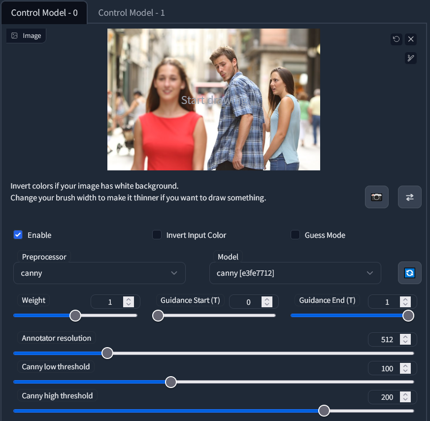
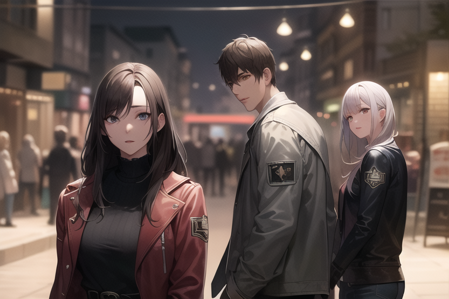
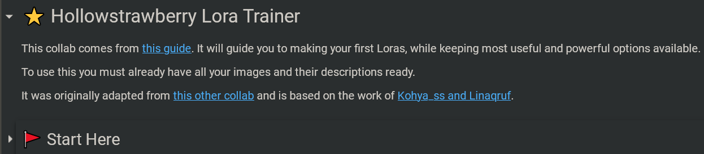
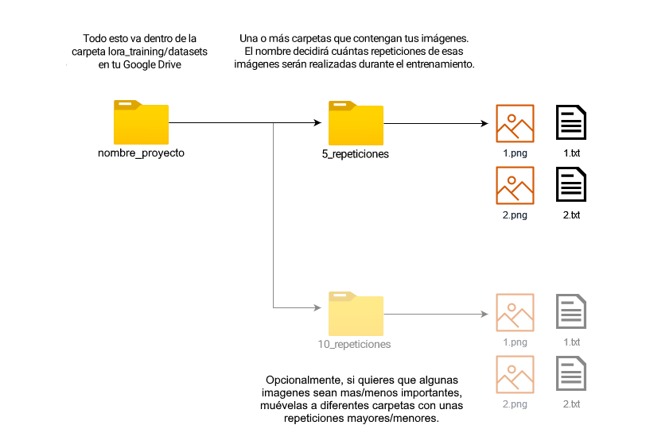

# Índice 

* [Introducción](#intro)
* [Google Colab](#colab)
* [Instalación Local (Windows + Nvidia)](#install)
* [Conceptos Esenciales](#start)
   1. [Modelos](#model)
   1. [VAEs](#vae)
   1. [Prompts](#prompt)
   1. [Opciones de generación](#gen)
* [Extensiones](#extensions)
* [Loras](#lora)
* [Imágenes Grandes](#upscale)
* [Scripts](#imgscripts)
   * [X/Y/Z Plot](#plot)
   * [Prompt Matrix](#matrix)
   * [Ultimate Upscaler](#ultimate)
* [ControlNet](#controlnet)
* [Entrenamiento de Loras para novatos](#train)
    * [Colab de entrenamiento](#traincolab)
    * [Archivos de entrenamiento](#datasets)
    * [Opciones de entrenamiento](#trainparams)
    * [Probar tus resultados](#traintest)
    * [Consejos adicionales](#trainchars)
* [...vtubers?](#vtubers)
 
&nbsp;

# Introducción [郊쑇(#index)

Stable Diffusion es una poderosa herramienta de generación de imágenes a través de inteligencia artificial (IA), la cual puedes usar en tu propio hogar. Ésta utiliza "modelos", los cuales son el cerebro de la IA y pueden crear casi cualquier cosa, siempre y cuando alguien los haya entrenado para ello. Los usos más populares son generación de arte anime, de fotorealismo, y de contenido para adultos.

Las imágenes que creas pueden ser usadas para cualquier propósito, siempre y cuando sigan la licencia del modelo utilizado. Estas imágenes puede o no que sean "tuyas" en un sentido legal, dependiendo de las leyes de tu país, y comúnmente es inconcluso. Ni yo ni nadie asociado con Stable Diffusion y sus modelos somos responsables por el contenido que generes, y se te prohibe usar estas herramientas para generar contenido ilegal o dañino.

Esta guía está actualizada hasta Marzo de 2023. Una semana es como un año para el desarrollo de IAs, así que espero que siga siendo útil para cuando la leas.

&nbsp;

# Google Colab [郊쑇(#index)

La manera más facil de usar Stable Diffusion es a través de Google Colab. Con él tomas prestado los computadores de Google para usar la IA, con tiempo limitado, comúnmente varias horas al día. Necesitarás al menos una cuenta de Google y utilizaremos el Google Drive para guardar tus imágenes.

Si en su lugar deseas correr el programa en tu propio computador, [baja aquí ▼](#install).

Aquí las instrucciones del colab. Estaremos usando el stable-diffusion-webui de Automatic1111.

1. Abre [esta página con el colab de nocrypt en español](https://colab.research.google.com/drive/11-LDA0nvFprS_-g7-ZmTzsDVNpGzRvfO?usp=sharing).

1. Cerca de arriba clickea **Copiar a mi Drive**. Espera que se abra la ventana nueva y cierra la vieja. Ahora tienes tu propio colab el cual puedes configurar a tu gusto, y deberás abrir desde tu Google Drive. En caso de actualizaciones deberás ver el original.

1. Si deseas puedes activar las siguientes casillas bajo **Configuraciones**: `guardar_imagenes_en_drive, guardar_configuracion_en_drive`.

1. Si ya conoces Stable Diffusion puedes pegar los enlaces a tus recursos deseados en la casilla de texto de `enlaces_adicionales`, bajo **Modelos y otros recursos**. Puede que vayamos a añadir enlaces aquí más adelante en la guía. Los enlaces deben ser **descargas directas** a cada archivo (idealmente de los sitios civitai o huggingface), y deben separarse por comas.

1. Ahora puedes presionar el botón de reproducción a la izquierda, en cualquier lugar dentro de la gran sección llamada **Empezar aquí 🚀**. Espera un par de minutos para que se instale y corra el programa. Verás aparecer mensajes de progreso más abajo. Eventualmente uno de estos mensajes será **Running on public URL** lo cual indica que está listo, y puedes abrir ese enlace en una nueva pestaña para utilizar Stable Diffusion. **¡Mantén la pestaña del colab abierta!** (en teléfono intenta el truco en la parte de abajo del colab para evitar que se cierre la pestaña)

1. Ahora estás listo para hacer algunas imágenes. Pero eso no es todo, y además, 쯤ué son todas estas opciones? [Baja aquí ▼](#start) para aprender las bases.

&nbsp;

# Instalación Local (Windows + Nvidia) [郊쑇(#index)

Para correr Stable Diffusion en tu propio computador necesitarás al menos 16 GB de RAM y 4 GB de VRAM (idealmente 8). Por ahora sólo voy a explicar el caso en que uses Windows 10/11 y poseas una tarjeta gráfica NVIDIA de serie 10XX o mayor. Mis disculpas si tienes AMD o usas Linux o Mac, pero con ellos es más complejo. Si no cumples estas condiciones aún puedes usar el Google Colab [aquí arriba 郊쑇(#colab).

Aquí las instrucciones de instalación. Utilizaremos un launcher para correr el stable-diffusion-webui de Automatic1111.

1. Obtén el instalador más reciente desde [esta página](https://github.com/EmpireMediaScience/A1111-Web-UI-Installer/releases). 

1. Corre el instalador (dile a Windows que no es un virus) y selecciona una ubicación sencilla y accesible en donde instalar. Espera a que termine.

1. Corre el programa, éste es el launcher. Verás algunas opciones. Primero activa **medvram** y **xformers**. Si tu gráfica tiene 12 GB de VRAM o más no es necesario medvram.

1. En la casilla de texto que dice *Additional Launch Options* pega lo siguiente: `--opt-channelslast --no-half-vae --theme dark` . Si añades más opciones sepáralas con espacios.
   * Si tu gráfica tiene 4 o 6 GB de VRAM añade `--opt-split-attention-v1` lo cual puede ayudar un poco.
   * Si deseas correr el programa en un dispositivo y usarlo a través de otro dispositivo en la misma red de WiFi (como en tu teléfono), puedes añadir `--listen --enable-insecure-extension-access` . Tras iniciar el programa podrás conectarte desde el navegador usando la IP local en el puerto 7860. También puedes añadir una contraseña con `--gradio-auth nombre:contr` .
   * Puedes encontrar todas las opciones [aquí](https://github.com/AUTOMATIC1111/stable-diffusion-webui/wiki/Command-Line-Arguments-and-Settings).

1. Presiona **Launch** y espera a que cargue y/o termine de instalar. Cuando termine se abrirá una ventana en tu navegador.

1. La página está abierta, es tu propio sitio web privado. Aquí en la pestaña principal (txt2img) es donde harás casi todas tus imágenes. Pero primero iremos a la pestaña **Settings**, y veremos algunas secciones del lado izquierdo.
   * En la sección de *Stable Diffusion* baja al final y aumenta el **Clip skip** de 1 a 2. Se dice que produce mejores imágenes.
   * En la sección *User Interface*, baja hasta **Quicksettings list** y cámbialo a `sd_model_checkpoint, sd_vae` .
   * Vuelve a subir y presiona el gran **Apply settings**, luego **Reload UI**.

1. Ahora estás más que listo para generar imágenes, pero sólo tienes el modelo básico. No es muy bueno, sirve para pinturas entre otras cosas. Además, 쯤ué son todas estas opciones? Ve [aquí abajo ▼](#start) para aprender las bases.

&nbsp;

# Conceptos Esenciales [郊쑇(#index)

Antes o después de hacer tus primeras imágenes, querrás leer la información de aquí abajo para mejorar tu experiencia y resultados. Si seguiste las instrucciones de esta guía, la parte de arriba de tu página de *Stable Diffusion WebUI* debería verse parecida a esto:

Aquí puedes seleccionar un checkpoint y un VAE. Ahora explicaré qué son ambas cosas y cómo obtenerlas. El colab tiene más opciones aquí arriba pero puedes ignorarlas.

1. **Modelos** [郊쑇(#index)

   El **modelo**, también llamado **checkpoint**, es el cerebro de tu IA, diseñado para producir cierto tipo de imágenes. Hay muchas opciones, las cuales puedes encontrar aquí en huggingface o en [civitai](https://civitai.com). Ya que aún no sabes elegir, estas son mis recomendaciones:
   * Para hacer anime, [7th Heaven Mix](https://civitai.com/models/4669/corneos-7th-heaven-mix) tiene un estilo placentero, estéticamente parecido a las películas de anime, mientras que [Abyss Orange Mix 3](https://civitai.com/models/9942/abyssorangemix3-aom3) *(__Nota:__ Baja allí y elige la opción AOM3)* ofrece más realismo con luces suaves, y más lascivia. Personalmente mezclé estas dos opciones creando así [Heaven Orange Mix](https://civitai.com/models/14305/heavenorangemix).
   * Aunque AOM3 es extremadamente capaz de hacer contenido para adultos, el popular modelo de hentai [Grapefruit](https://civitai.com/models/2583/grapefruit-hentai-model) también puede cumplir tus deseos.
   * Para arte en general elige [DreamShaper](https://civitai.com/models/4384/dreamshaper), no hay nada que se le acerque en términos de creatividad. También está [Pastel Mix](https://civitai.com/models/5414/pastel-mix-stylized-anime-model), el cual tiene una hermosa y única estética con un poco de anime.
   * Para el fotorealismo recomiendo [Deliberate](https://civitai.com/models/4823/deliberate). Puede hacer casi cualquier cosa, pero fotos en especial. Muy detallado.
   * El modelo [URPM](https://civitai.com/models/2661/uber-realistic-porn-merge-urpm) es la mayor concentración de pornografía que vas a encontrar.
   
   Si estás usando el colab de está guía, algunos de estos están disponibles como opciones. Para otros modelos, debes copiar el **enlace directo a la descarga** y pegarlo en la casilla llamada `enlaces_adicionales`. Separa múltiples enlaces usando comas.

   En una instalación local, comúnmente los modelos deben ir dentro de la carpeta `stable-diffusion-webui/models/Stable-diffusion`.

   Una nota importante es que los checkpoints deben estar en formato `.safetensors`, ya que algunos archivos `.ckpt` **pueden** contener virus. Ten cuidado. Además, cuando elijas modelos a veces verás varias opciones tales comoo fp32, fp16 y pruned. Para generar imágenes todas funcionan igual, así que elige el archivo más pequeño (pruned-fp16). Para mezclar o entrenar modelos se recomienda el archivo más grande.

   **Consejo:** Tras añadir el archivo de un recurso a las carpetas del programa, podrás encontrarlo tras presionar 🔃 junto al lugar donde lo selecciones.

1. **VAEs** [郊쑇(#index)

   La mayoría de checkpoints no viene con VAE incluído. El VAE es un pequeño modelo aparte, el cual "convierte tu imagen a formato humano". Sin un VAE tus imágenes van a tener malos colores y detalles.

   Si usas el colab de esta guía, ya deberían estar todos los VAEs instalados.
   
   Prácticamente sólo hay 3 VAEs en circulamiento:
   * [anything vae](https://huggingface.co/WarriorMama777/OrangeMixs/resolve/main/VAEs/orangemix.vae.pt), también conocido como orangemix vae. Todos los modelos de anime lo utilizan.
   * [vae-ft-mse](https://huggingface.co/stabilityai/sd-vae-ft-mse-original/blob/main/vae-ft-mse-840000-ema-pruned.safetensors), el oficial de Stable Diffusion, utilizado comúnmente por modelos realistas.
   * [kl-f8-anime2](https://huggingface.co/hakurei/waifu-diffusion-v1-4/resolve/main/vae/kl-f8-anime2.ckpt), también conocido como el vae de Waifu Diffusion, es más viejo y tiene colores más brillantes. Lo utiliza Pastel Mix.

   Si usas el launcher puedes elegir el VAE antes de iniciar el programa, de otra forma los VAEs deben ir en la carpeta `stable-diffusion-webui/models/VAE`.
   
   Si no has seguido esta guía hasta este punto, dentro de tu página deberás ir a la pestaña **Settings**, luego la seccción **Stable Difussion**, y allí escoger tu VAE y guardar los cambios.

   **Consejo:** Tras añadir el archivo de un recurso a las carpetas del programa, podrás encontrarlo tras presionar 🔃 junto al lugar donde lo selecciones.

1. **Prompts** [郊쑇(#index)

   Harás casi todas tus imágenes en la primera pestaña de tu página, **txt2img**. Aquí verás dos grandes casillas que llamamos *prompt* y *prompt negativo*. Aquí deberás describir lo que deseas que aparezca y no aparezca en tu imagen, **y debe ser en inglés**.  
   Stable Diffusion no es como Midjourney u otros servicios populares, no puedes solo decir lo que quieres, sino que debes ser *muy* específico.  
   Debido a esto la mayoría de personas se aferran a algún prompt que le funcione bien a ellos, muchas veces recomendado por otra persona. Aquí recomiendo mis propios prompts y prompts negativos:
   
   * Anime
      * `2d, masterpiece, best quality, anime, highly detailed face, highly detailed background, perfect lighting`
      * `EasyNegative, worst quality, low quality, 3d, realistic, photorealistic, (loli, child, teen, baby face), zombie, animal, multiple views, text, watermark, signature, artist name, artist logo, censored`
     
   * Fotorealismo
      * `best quality, 4k, 8k, ultra highres, raw photo in hdr, sharp focus, intricate texture, skin imperfections`
      * `EasyNegative, worst quality, low quality, normal quality, child, painting, drawing, sketch, cartoon, anime, render, 3d, blurry, deformed, disfigured, morbid, mutated, bad anatomy, bad art`

   * **EasyNegative:** El prompt negativo que recomiendo utiliza EasyNegative, un *embedding* o "palabra mágica" que codifica muchas cosas malas para así mejorar tus imágenes. De otra forma tu prompt negativo sería enorme.
      * Si usas el colab de esta guía, ya tienes instalado EasyNegative. Sino, es un archivo diminuto que puedes [descargar aquí](https://huggingface.co/datasets/gsdf/EasyNegative/resolve/main/EasyNegative.safetensors) y debes colocar en la carpeta `stable-diffusion-webui/embeddings`. Finalmente debes reiniciar el programa para así poder usar esta palabra mágica.

   Puedes ver una comparación de prompts negativos incluyendo EasyNegative más abajo en [Prompt Matrix ▼](#matrixneg).

   

   Después de un "prompt base" como los que te he mostrado, puedes comenzar a escribir lo que desees. Por ejemplo, `young woman in a bikini in the beach, full body shot`. También puedes añadir más términos negativos, como `old, ugly, futanari, furry`, etc.  
   Puedes guardar tus prompts usando los botones debajo de Generate. Presiona el pequeño 💾 *Save style* y asigna un nombre al prompt actual. Tras ello podrás abrir tus *Styles* para elegirlo, y luego presionar 📋 *Apply selected styles to the current prompt* para añadirlo.

   Una técnica importante en los prompts es la intensidad. Cuando encierras algo en `(paréntesis)`, tendrá más intensidad o **peso** en tu imagen, diciéndole a la IA que esa parte es más importante. El peso normal para todas las palabras es 1, y cada paréntesis multiplica por 1.1 (puedes usar varios). También puedes especificar el peso tú mismo, por ejemplo: `(full body:1.4)`. También puedes hacerlo menor a 1 para bajar la intensidad; los `[corchetes]` multiplican por 0.9, pero si quieres ser preciso también necesitas paréntssis, como `(así:0.5)`.

   Podrás notar que la IA es famosamente mala para hacer manos y pies. Con estos buenos prompt mejorarán un poco, pero quizá debas usar photoshop, inpainting, o técnicas avanzadas como [ControlNet ▼](#controlnet) para perfeccionar tu imagen.

1. **Opciones de generación** [郊쑇(#index)

   Ya te enseñé a elegir un modelo, VAE y escribir tus prompt, ahora podrás saber sobre todo el resto de las opciones disponibles antes de generar una imagen.
   
   

   * **Sampling method:** Es el algoritmo que genera tu imagen, cada uno con resultados distintos. El por defecto de `Euler a` casi siempre es el mejor, y también obtendrás muy buenos resultados con `DPM++ 2M Karras` y `DPM++ SDE Karras`. Una comparación más abajo.
   * **Sampling steps:** La cantidad de pasos, son "calculados" con anticipacicón y por lo tanto más pasos no siempre es mejor. Yo siempre uso 30 pasos, pero de 20 a 50 encontrarás resultados consistentemente buenos. Una comparación más abajo.
   * **Width and Height:** La resolución de 512x512 es lo normal. Si superas el ancho o alto de 768 tu imagen puede ser distorsionada y deformada. Para producir imágenes más grandes está la opción `Hires fix`.
   * **Batch Count and Batch Size:** El *size* es cuántas imágenes tu tarjeta gráfica producirá al mismo tiempo, lo cual se limita for su VRAM. El *count* son las repeticiones del valor anterior. Los batches tienen seeds consecutivas, más abajo verás las seeds.
   * **CFG Scale:** "Los valores menores producen resultados más creativos". Casi siempre debes dejarlo en 7, pero de 4 a 10 es un rango aceptable.
   * **Seed:** Un número que dicta la generación de tu imagen. La misma seed con el mismo prompt y opciones siempre producirá la misma imagen, salvo detalles menores y algunas excepciones.
  
   **Hires fix:** Esta opción te permite crear imágenes más grandes sin problemas. Por lo general se ocupa para duplicar el ancho y alto. Cuando la actives, aparecerán más opciones:
   * **Upscaler:** El algoritmo para agrandar la imagen. Se dice que `Latent` crea resultados creativos. Puede que también te guste `R-ESRGAN 4x+` y su variante para anime. [Más información y comparaciones más abajo ▼](#upscale).
   * **Hires steps:** Recomiendo al menos la mitad de tus pasos normales. Más pasos no siempre es mejor, y son bastante lentos, así que sé conservador.
   * **Denoising strength:** El valor más importante. Cera de 0.0 tu imagen no tendrá ningún detalle nuevo. Cerca de 1.0, tu imagen cambiará completamente. Recomiendo un valor entre 0.2 y 0.6 dependiendo del caso, lo cual añade suficiente detalle sin *destruir* los detalles existentes que te gusten.
    
   Others:
   * **Restore faces:** Puede mejorar los rostros reales. Nunca lo he necesitado con los prompt de esta guía y con hires fix.
   * **Tiling:** Sirve para hacer patrones repetitivos como baldosas, no es muy útil.
   * **Script:** Te permite acceder a funciones y extensiones muy útiles, [las cuales explico más abajo ▼](#plot). Por ejemplo, X/Y/Z Plot permite comparar una cuadrícula de imágenes con diferentes opciones. Muy poderoso.

   Aquí comparo algunos samplers populares y varios cantidades de pasos:

   

   
(Click) Comparación de samplers - Fotografía

   
   

   

   
(Click) Comparación de samplers - Anime

   
   

   Corta explicación de la comparación de arriba: `Euler` es un sampler básico. `DDIM` es más rapido mientras que `DPM++ 2M Karras` es mejorado. Mientras tanto `Euler a` o "ancestral" produce resultados más creativos, y `DPM++ 2S a Karras` algo similar ya que también es ancestral. Finalmente `DPM++ SDE Karras` es el más lento y bastante único. Hay muchos otros samplers pero la mayoría están relacionados.

&nbsp;
  
# Extensiones [郊쑇(#index)

*Stable Diffusion WebUI* es el programa que estamos ocupando y éste permite añadir extensiones muy útiles. Para ello dirígete a la pestaña **Extensions**, luego a **Install from URL**, y pega allí alguno de estos enlaces de github. Luego presiona *Install* y espera que se instale. Cuando termines ve a **Installed** y presiona *Apply and restart UI*.
 

Aquí hay algunas extensiones útiles. Si usas el colab de esta guía la mayoría ya están instaladas, sino, recomiendo enormemente instalar manualmente las primeras 2.
* [Image Browser (bugfix)](https://github.com/aka7774/sd_images_browser) - Navegador de Imágenes, permite ver todas las imágenes wue has creado y rápidamente enviarlas con sus parámetros a txt2img, img2img, etc.
* [TagComplete](https://github.com/DominikDoom/a1111-sd-webui-tagcomplete) - Completamente esencial para hacer anime, te muestra las tags de booru existentes mientras escribes tu prompt. Los modelos de anime funcionan a través de estos tags, haciendo de ésta una de las mejores extensiones. Ojo que no todas las tags funcionan siempre, sobre todo si son poco comunes.
* [ControlNet](https://github.com/Mikubill/sd-webui-controlnet) - Enorme extensión con [su propia guía ▼](#controlnet). Te permite analizar cualquier imagen existente y usarla como muestra para guiar tus propias imágenes. En términos prácticos, te permite replicar cualquier pose o ambiente que desees.
* [Ultimate Upscale](https://github.com/Coyote-A/ultimate-upscale-for-automatic1111) - Un script usable desde img2img que permite hacer imágenes enormes aunque tengas poca vram, dividiéndolas en secciones aunque sea más lento. [Ver su guía aquí ▼](#ultimate).
* [Two-shot](https://github.com/opparco/stable-diffusion-webui-two-shot) - Normalmente no es posible crear escenas de dos personajes, ya que el prompt hace que se fusionen sus características. Esta extensión permite dividir la imagen en: todo, izquierda, derecha; permitiendo así tener escenas naturales con 2 personajes o temas al mismo tiempo.
* [Dynamic Prompts](https://github.com/adieyal/sd-dynamic-prompts) - Un script para tener prompts semi-aleatorios. Un poco complejo.
* [Model Converter](https://github.com/Akegarasu/sd-webui-model-converter) - Permite convertir modelos de 7 GB o 4 GB a 2 GB, seleccionando  `safetensors`, `fp16`, y `no-ema`. Estos modelos "pruneados" funcionan prácticamente igual para generar imágenes. La mayoría de modelos hoy en día vienen en este formato de todas formas.

&nbsp;

# Loras [郊쑇(#index)

Los Loras son una tecnología moderna y un tipo de **Extra Network** que permite añadir una especie de modelo pequeño a cualquiera de tus modelos principales. Son similares a los embeddings, uno de los cuales te mostré [antes 郊쑇(#promptneg), pero los Loras son más grandes y comúnmente más capaces. No entraré en detalles técnicos.

Un Lora puede representar un personaje, estilo, pose, ropa, o incluso un rostro humano (aunque no estoy de acuerdo con ello). Los checkpoints son bastante capaces para contenido general, pero para detalles como estos es donde comienzan a fallar y necesitarás un Lora. Podrás descargar Loras desde [civitai](https://civitai.com) u [otros lugares (NSFW)](https://gitgud.io/gayshit/makesomefuckingporn#lora-list) y su tamaño es de 144 MB por defecto, pero pueden ser tan pequeños como 1 MB. Los Loras más grandes no son necesariamente mejores. Los Loras vienen en formato `.safetensors` de igual forma que los checkpoints.

Coloca tus archivos de Lora en la carpeta `stable-diffusion-webui/models/Lora`, o si estás usando el colab de esta guía pega el enlace directo a la descarga en la casilla `enlaces_adicionales`. Luego encuentra el botón 游꿦 *Show extra networks* bajo el gran botón naranjo, el cual abrirá una nueva sección de extra networks. Presiona la pestaña Lora y presiona **Refresh** para escanear nuevos Loras. Cuando hagas click en uno de tus Loras se añadirá a tu prompt, y se verá así: `<lora:archivo:1>` . Siempre se verán así, donde "archivo" es el nombre exacto del archivo en tu sistema (antes de `.safetensors`). Finalmente, el número es el peso, lo cual expliqué [previamente 郊쑇(#promptweight). La mayoría de Loras funcionan con un peso entre 0.5 y 1, y los valores muy grandes pueden "cocinar" tu imagen, especialmente si usas más de uno al mismo tiempo.

Además, muchos Loras tendrán una "palabra de activación" para que tomen efecto, por ejemplo el nombre del personaje en caso de ser un Lora de personaje.

Un ejemplo de Lora es [Thicker Lines Anime Style](https://civitai.com/models/13910/thicker-lines-anime-style-lora-mix), un gran estilo de ánime clásico si deseas probarlo. No tiene palabra de activación.

&nbsp;

# Imágenes Grandes [郊쑇(#index)

Como [mencionamos anteriormente 郊쑇(#gen), normalmente no debes generar imágenes sobre 768 de ancho y alto. Debes usar Hires fix, con un "upscaler" (algoritmo) y denoising (intensidad) apropiados. Hires fix está limitado por tu VRAM, por lo que te puede interesar [Ultimate Upscaler ▼](#ultimate).

Es posible descargar upscalers adicionales y ponerlos en tu carpeta `stable-diffusion-webui/models/ESRGAN`. Así funcionarán con Hires fix, Ultimate Upscaler, y Extras.

El colab de esta guía viene con varios de estos, incluyendo **Remacri**, uno de los mejores para todo tipo de imágenes. Se puede encontrar aquí abajo.

* Algunos upscalers notables [se pueden encontrar aquí](https://huggingface.co/hollowstrawberry/upscalers-backup/tree/main/ESRGAN).
* LDSR es un upscaler avanzado pero lento, sus dos archivos [se encuentran aquí](https://huggingface.co/hollowstrawberry/upscalers-backup/tree/main/LDSR) y deben ser puestos en `stable-diffusion-webui/models/LDSR`.
* La [Upscale Wiki](https://upscale.wiki/wiki/Model_Database) contiene docenas de opciones históricas.

Aquí hay algunas comparaciones. Todas fueron hechas con denoising de 0.4. Ojo que algunas diferencias pueden ser completamente debido al azar. Desafortunadamente no puedo mostrar LDSR por limitaciones de VRAM.

   
(Click) Comparación 1: Anime, estilizado, fantasía

   
   

   
(Click) Comparación 2: Anime, detallado, iluminación suave

   
   

   
(Click) Comparación 3: Fotografía, humano, naturaleza

   
   

&nbsp;

# Scripts [郊쑇(#index)

Los Scripts se encuentran al final de tus opciones de generación de imágenes, tanto en txt2img como img2img.

* **X/Y/Z Plot** [郊쑇(#index)

   Capaz de generar una serie de imágenes, por lo general con la misma seed, pero cambiando algunos otros parámetros que tú elijas. Permite comparar casi cualquier cosa que desees, como diferentes modelos, partes de tu prompt, sampler, upscaler y mucho más. Puedes tener 1, 2 ó 3 parámetros variables, de allí el X, Y, Z.

   Debes separar tus parámetros con comas, y cualquier otra cosa puede ir entre medio. El parámetro más común es **S/R Prompt**, donde antes de la coma escribes una parte de tu prompt, y cada coma precede una frase que la reemplazará. Sabiendo esto, podemos comparar, por ejemplo, el peso/intensidad de un Lora, así:
   
   `<lora:mi lora:0.4>, <lora:mi lora:0.6>, <lora:mi lora:0.8>, <lora:mi lora:1>`

   Aquí abajo he hecho una comparación de diferentes **modelos** (en las columnas) y rostros de diferentes países con **S/R Prompt** (en las filas):
   
   

   
(Click) Ejemplo de X/Y/Z Plot

   
   
   

   **Consejo:** Parece posible hacer S/R incluyendo comas si utilizas comillas de la siguiente forma, sin espacio entre cada coma y comilla: `"frase 1, frase 2","frase 3, fase 4","frase 5, frase 6"`

* **Prompt Matrix** [郊쑇(#index)

   Un concepto similar al S/R anterior, pero con mayor profundidad. Lo que hace es una cuadrícula, la cual muestra cada posible combinación de términos, donde los términos estarán separados con un `|` en tu prompt. Por ejemplo, `young man|tree, grass|city` - aquí "young man" siempre será considerado, pero podremos ver qué pasa al añadir o quitar "tree, grass" y/o "city".
   
   Dentro del script puedes elegir hacerlo con tu prompt o tu negative prompt, y si quieres que los términos adicionales se introduzcan al inicio o al final.

   Aquí hay una comparación de los negative prompt que te mostré [anteriormente 郊쑇(#prompt). Podemos ver cómo EasyNegative afecta la imagen, cómo el resto del negative prompt afecta la imagen, y luego ambos juntos:

   

   
(Click) Ejemplo de Prompt Matrix

  
   
   
   

   **Tip:** Aumentando el Batch Size puedes crear todo el prompt matrix al mismo tiempo.

* **Ultimate Upscale** [郊쑇(#index)

   Ésta es una versión mejorada de un script básico y debe ser añadida como una [extensión 郊쑇(#extensions) para ser usada desde **img2img**. Su propósito es agrandar una imagen así añadiendo más detalles, sobrepasando el límite de tu gráfica dado que divide la imagen en secciones, aunque esto sea más lento. Aquí las instrucciones:

   1. Genera tu imagen normalmente hasta un ancho y largo de 768, y aplica Hires fix si es que puedes.

   1. Desde txt2img o la extensión del navegador de imágenes, envía directamente la imagen con sus parámetros a img2img.
   
   1. Ajusta el  **Denoising** entre 0.1 y 0.4. Valores más grandes probablemente introduzcan mutaciones en tu imagen.

   1. Baja a **Scripts** y elije **Ultimate SD Upscale**. Configúralo de la siguiente forma, con el tamaño y upscaler que desees, y con el **Type "Chess"**:
   
      
      
      * Si tienes suficiente VRAM puedes aumentar el **Tile width** y el **Padding**, por ejemplo duplicando ambos. Así será más rápido. El **Tile height** puede permanecer en 0.
     
      * No es necesario cambiar el **Seams fix** a menos que la imagen final muestre distorsiones visibles entre cada zona cuadrada.
     
   1. Genera tu imagen y espera que empiece. Podrás ver cómo los cuadros se vuelven más nítidos si es que tienes activada la previsualización de imágenes.
   
&nbsp;

# ControlNet [郊쑇(#index)

ControlNet es una tecnología reciente extremadamente poderosa. Te permite analizar una imagen para guiar la creación de tus propias imágenes con Stable Diffusion. Veremos qué significa esto en un momento.

Si estás usando el colab de esta guía activa la casilla de `todos_modelos_controlnet` antes de iniciarlo. Sino, deberás instalar la [extension ControlNet 郊쑇(#extensions), luego ir [aquí](https://civitai.com/models/9251/controlnet-pre-trained-models) y descargar modelos de controlnet que deberás poner en la carpeta `stable-diffusion-webui/extensions/sd-webui-controlnet/models`. Recomiendo los modelos Canny, Depth, Openpose y Scribble, los cuales veremos en un momento.

Voy a demostrar cómo ControlNet puede ser usado. Para ello tomaré una imagen popular en internet como nuestra "imagen de muestra". No es necesario que me sigas paso a paso, pero puedes descargar las imágenes y ponerlas en la pestaña **PNG Info** para ver los datos de generación.

Primero, debes estar en txt2img y bajar para presionar el menú ControlNet. Una vez abierto presiona *Enable*, y elige un *preprocessor* y *model* con el mismo nombre. Para empezar elegiré Canny para ambos. Finalmente añadiré mi imagen de muestra. Asegúrate de no clickear sobre la imagen de muestra o comenzarás a dibujar. Podemos ignorar el resto de las opciones.

* **Canny**

   El método Canny extrae los detalles de la imagen de muestra. Es útil para imitar todo tipo de imágenes. Observa:

   

   
(Click) Ejemplo de Canny

   
   
   
   

* **Depth**

   El método Depth extrae los elementos 3D de la imagen de muestra. Es de enorme utilidad cuando deseas imitar ambientes complejos y la composición general de una imagen. Observa:

   

   
(Click) Ejemplo de Depth

   
   
   
   

* **Openpose**

   El método Openpose extrae las poses humanas de la imagen de muestra. Es de extrema utilidad para obtener la toma deseada y composición de uno de tus personajes. Observa:

   

   
(Click) Ejemplo de Openpose

   
   
   
   

* **Scribble**

   Scribble te permite hacer un bosquejo y convertirlo en una pieza terminada con ayuda de tu prompt. Este es el único ejemplo de aquí que no comparte la misma imagen de muestra.

   

   
(Click) Ejemplo de Scribble

   
   
   
   

Podrás notar que hay 2 resultados para cada método. El primero es en paso intermedio llamado la "imagen pre-procesada", la cual se usa para producir la imagen final. Puedes entregar una imagen pre-procesada tú mismo, en tal caso deberás elegir un preprocessor de *None*. Esto puede ser tremendamente poderoso tomando en cuenta herramientas externas tales como Blender y Photoshop.

En la pestaña Settings habrá una sección ControlNet donde podrás activar *múltiples controlnets al mismo tiempo*. Un uso particularmente útil es cuando uno de ellos es Openpose, para obtener tanto la pose deseada como el ambiente deseado, o con la posición exacta de manos u otros detalles. Observa:

(Click) Ejemplo de Openpose+Canny

  

También puedes usar ControlNet en img2img, en tal caso la imagen de entrada y la imagen de muestra ambas tendrán ciertos efectos en el resultado. No tengo mucha experiencia con este método.

Además, existen la version **diff** de los modelos de controlnet, los cuales producen resultados ligeramente distintos. Puedes [probarlos](https://civitai.com/models/9868/controlnet-pre-trained-difference-models) si deseas, pero yo no lo he hecho.

&nbsp;

# Entrenamiento de Loras para novatos [郊쑇(#index)

Entrenar un [Lora 郊쑇(#lora) tú mismo es una especie de logro. No es la gran cosa, pero hay muchas variables involucradas, y mucho trabajo dependiendo de las técnicas que utilices. Es una mezcla entre un arte y una ciencia.

Puedes entranar Loras en tu propio computador si tienes al menos 8 GB de VRAM. Sin embargo utilizaré un documento de Google Colab por motivos educacionales.

He aquí unos recursos clásicos si deseas leer sobre el tema en profundidad. Puede que Rentry esté bloqueado por tu proveedor de internet, en tal caso puedes usar un VPN o intentar poner la página a través de [Google Translate](https://translate.google.cl/?op=websites).
* [Entrenamiento de Loras, en Rentry](https://rentry.org/lora_train)
* [Ciencia de Loras, en Rentry](https://rentry.org/lora-training-science)
* [Entrenador original de Kohya (método Dreambooth)](https://colab.research.google.com/github/Linaqruf/kohya-trainer/blob/main/kohya-LoRA-dreambooth.ipynb)
* [Lista de parámetros del entrenador](https://github.com/derrian-distro/LoRA_Easy_Training_Scripts#list-of-arguments)

Con dichos recursos mucho más inteligentes puestos de lado, intentaré producir una guía simple para que puedas hacer tu propio Lora, de un personaje, concepto o estilo.

**Colab de entrenamiento** [郊쑇(#index)

1. Utilizaremos [ESTE DOCUMENTO DE COLAB](https://colab.research.google.com/drive/1dkiziaR1rizn7f6jRM7jwH6KxpaoY0-w?usp=sharing). Puedes copiarlo a tu Google Drive si deseas.

1. Presiona el botón de reproducción de *🇦 Montar tu google drive* y dale acceso cuando lo pida. Haz lo mismo con *🇧 Instalación*. Mientras se instala en el servidor de Google, sigue al siguiente paso.

1. Baja a *🇨 Configuración* pero aún no lo actives. Aquí en **Inicio** puedes darle cualquier nombre a tu proyecto. También puedes cambiar el modelo base que utilizaremos, pero para esta guía utilizaremos `animefull-final` ya que es la base de casi todos los modelos anime y produce los resultados más consistentes. De otra forma recomendaría `AnythingV3`. Si deseas entrenar con fotografías puedes copiar el enlace al modelo base de [Stable Diffusion 1.5](https://huggingface.co/runwayml/stable-diffusion-v1-5/resolve/main/v1-5-pruned-emaonly.safetensors) o al modelo realista que desees utilizar (tal como [Deliberate](https://civitai.com/api/download/models/15236)).

1. **Archivos de entrenamiento** [郊쑇(#index)
  
   Esta es la mayor parte del entrenamiento de Loras. Necesitarás recopilar un "dataset" o archivos de entrenamiento, los cuales consisten en imágenes y sus correspondientes descripciones (con tags en el caso de anime).

   1. Encuentra imágenes online que representens el personaje/concepto/estilo que deseas entrenar, posiblemente en sitios tales como [gelbooru](https://gelbooru.com/). Asegúrate que sean imágenes de calidad decente en diferentes ángulos, escenas, ropa, etc. Necesitas al menos 10 imágenes, recomiendo 20 o más, y por lo general mientras más mejor.
      * Opcionalmente, puedes instalar [Grabber](https://github.com/Bionus/imgbrd-grabber/releases) para descargar cientos de imágenes automáticamente. Recomiendo buscar en gelbooru y pixiv, para un personaje sería con estas tags: `1girl solo character_name score:>10 -rating:explicit` (lo explícito suele ser raro y por lo tanto se puede excluir).
  
   1. Crea los archivos de texto junto a cada imagen, con el mismo nombre de archivo. Puedes escribir los tags tú mismo, aunque puede ser lento y poco preciso. Si son fotografías, descríbelas en detalle con oraciones simples.
      * Opcionalmente puedes agregar la [extensión Tagger](https://github.com/toriato/stable-diffusion-webui-wd14-tagger) para que analice tus imágenes y cree las tags de anime por ti. Las instrucciones son así: Añade y activa la extensión, y reinicia el programa. Luego dirígete a la nueva pestaña **Tagger**, luego a *atch from directory*, y selecciona la carpeta con tus imágenes. Pon el *output name* como `[name].txt` y el threshold a 0.2 o mayor (éste es la precisión de las tags). Finalmente presiona **Interrogate** y se crearán tus archivos de texto.
    
   1. Una vez que tus imágenes y descripciones estén listas, ponlas en una carpeta con la siguiente estructura: Una carpeta con el nombre de tu proyecto, la cual contiene al menos 1 carpeta en el formato `repeticiones_nombre`, la cual contiene tus archivos de entrenamiento. Así:
  
      

   1. Aquí es donde decides tu número de repeticiones, con el nombre de la carpeta interior. Recomiendo que tu cantidad de imágenes multiplicada por su número de repeticiones no supere un total de 400. Así que si tienes 20 imágenes, recomiendo 10 o 20 repeticiones, y más imágenes necesitarían menos. En tal caso, tu carpeta interior se llamará `10_repeticiones` (puedes cambiar la palabra "repeticiones" por un nombre a tu gusto).
  
   1. Sube la carpeta exterior y todos sus contenidos (la que tiene el nombre de tu proyecto) a tu Google Drive, en la carpeta `lora_training/datasets/`.
  
1. **Opciones de entrenamiento** [郊쑇(#index)

   * Bajo **Archivos**, no necesitas cambiar nada esta vez.
   * Bajo **Pasos**, puedes cambiar los epochs y batch size según lo descrito. Más epochs te dan más control sobre el progreso de tu Lora, y dará más tiempo para que aprenda, pero no exageres. Si tienes muchas imágenes puedes aumentar el batch size.
   * Bajo **Entrenamiento**, el `unet_aprendizaje` es el parámetro más importante. 1e-3 es el valor por defecto y funciona cuando tienes pocas imágenes, pero puede ir hasta 1e-5. También está el dim, el cual es el tamaño de tu Lora, y más grande no necesariamente es mejor (recomiendo dim 16, alpha 8).

1. Ahora puedes activar *🇨 Configuración*, esperar que el modelo se descarge, y finalmente comenzar el entrenamiento con *🇩 Cocinar el Lora*. Debería tomar 20 a 60 minutos si pusiste un número apropiado de repeticiones y epochs. Si encuentras errores intenta contactarme o buscar ayuda.

1. **Probar tus resultados** [郊쑇(#index)

   Ha pasado un rato y tu Lora terminó de entrenar/cocinar. Ve y descárgalo de la carpeta `lora_training/output` en tu google drive. Pero verás que hay más de uno; por defecto, se guarda una copia de tu Lora cada 2 epochs, permitiéndote así comparar su progreso. Si entrenas tu Lora por muchos epochs, podrás identificar el punto óptimo entre que esté "crudo" o "recocido".

   Cuando un Lora está "crudo", no alcanzará a imitar tus datos de entrenamiento. Cuando está "recocido", imita tus datos de entrenamiento *demasiado*, y comienza a distorsionar tus imágenes. Si tu dataset o parámetros estan mal, ¡puede que esté crudo y recocido al mismo tiempo!

   Usando lo aprendido en [X/Y/Z Plot 郊쑇(#plot), podemos hacer una comparación del progreso de nuestro Lora:

   

   Mira eso, ¡se vuelve cada vez más detallado! La última imagen no tiene ningún Lora para comparar. Este parece ser un Lora de personaje exitoso, pero necesitaríamos probar una variedad de seeds, ropas y escenas para estar seguros.

   * Si tus resultados no funcionan, puede que hayas entrenado muy poco tiempo o más probablemente tu tasa de aprendizaje era muy pequeña (intenta 5e-4 o en casos extremos 1e-3).
   * Si tus resultados están distorsionados, intenta bajar la intensidad de tu lora entre 0.5 y 0.8. Si siguen distorsionados o deja de funcionar, y epochs anteriores tampoco funcionan, entonces se te quemó el Lora y debes intentar una menor tasa de aprendizaje (1e-4 o 1e-5).
   * Si funciona bien pero tu personaje no puede cambiar de ropa/posición, tus imágenes de entrenamiento eran muy similares o sus tags estaban mal.
   * Si funciona bien pero el estilo se ve mal o con mal sombreado, puede que estés usando un modelo muy avanzado. Recomiendo `animefull-final-pruned` si puedes encontrarlo.
   
   Después de acostumbrarse a hacer Loras, e interactuar on la comunidad y sus variados recursos, estarás listo para usar otro método más avanzado como el [colab original todo-en-uno de kohya](https://colab.research.google.com/github/Linaqruf/kohya-trainer/blob/main/kohya-LoRA-dreambooth.ipynb). Buena suerte.

* **Consejos adicionales** [郊쑇(#index)

   La parte más importante para un personaje son los tags. Claro que necesitas imágenes con variadas poses y lugares, pero si las descripciones están mal no servirá de nada.

   Cuando entrenas un personaje o concepto deberías definir una **palabra de activación**, y ajustar el valor de `keep_tokens` a 1. Una palabra de activación es como podremos invocar a tu Lora para que funcione. Habiendo hecho eso, **algunas personas recomiendan** quitar o "limpiar" las tags que son intrínsicas a tu personaje o concepto, tales como el color de pelo y ojos. Por ejemplo, si una chica siempre tiene orejas de gato, quieres quitar las tags tales como `animal ears, animal ear fluff, cat ears`, y así éstas serán "absorbidas" por tu palabra de activación. Esto hará tu Lora más fácil de usar pero menos flexible.
   * Puedes usar [la extensión Tag Editor](https://github.com/toshiaki1729/stable-diffusion-webui-dataset-tag-editor) para añadir una palabra de activación a todos tus archivos al mismo tiempo. Es un poco complejo: Añade la extensión y reinicia tu webui, luego entra a la nueva pestaña **Dataset Tag Editor** y luego a *Batch Edit Captions*. Bajo *Edit Tags* escribe tu palabra de activación y enciende *Prepend additional tags*. Luego aplica los cambios (botón naranja), sube y guarda (botón naranja).

   Esta "absorción" de detalles no entregados por los tags es la forma en que los Loras funcionan en general, ya que logran aprender y representar los detalles imperceptibles o difíciles de explicar tales como el rostro, acccesorios, composición, etc. También puedes limpiar tags de ropa redundantes, como borrar "red tie" y dejar "tie". Incluso puedes tener una palabra de activación distinta para cada atuendo que tu personaje usa comúnmente, como personaje-normal, personaje-bikini, etc. Pero no es la única forma de hacerlo. En cualquier caso, si tus tags son correctas, tu personaje debería poder cambiar de ropa fácilmente.

   Mientras tanto, los Loras de estilo no necesitan palabra de activación, ya que deseamos que siempre estén activos. Absorberán el estilo artístico de forma natural, y funcionará con variados pesos.

   Otro consejo es tener más de una carpeta de repeticiones, y separarlas por calidad: Dar más repeticiones a tus mejores imágenes, y menos repeticiones (incluso 1) a las imágenes que quizá tienen peor estilo pero aún así aportan algo único.

&nbsp;

# ...vtubers? [郊쑇(#index)

Y así llegamos la final de la guía. Gracias por leer. Si tienes correcciones o contribuciones puedes abrir un Issue o un Pull Request en esta página y echaré un vistazo pronto.

Tengo [otra página dedicada a Loras de vtubers, en especial Hololive](https://huggingface.co/hollowstrawberry/holotard). Si es que es de tu interés.

Saludos.

&nbsp;