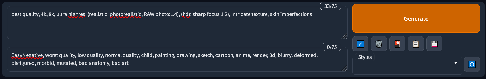

# Index 

* [Introducción](#intro)
* [Google Collab](#collab)
* [Instalación Local (Windows + Nvidia)](#install)
* [Conceptos Esenciales](#start)
   1. [Modelos](#model)
   1. [VAEs](#vae)
   1. [Prompts](#prompt)
   1. [Opciones de generación](#gen)
* [Extensiones](#extensions)
* [Loras](#lora)
* [Imágenes Grandes](#upscale)
* [Scripts](#scripts)
   * [X/Y/Z Plot](#plot)
   * [Prompt Matrix](#matrix)
   * [Ultimate Upscaler](#ultimate)
* [ControlNet](#controlnet)
* [Entrenamiento de Loras para novatos](#train)
    * [Archivos de entrenamiento](#datasets)
    * [Opciones de entrenamiento](#trainparams)
    * [Probar tus resultados](#traintest)
    * [Consejos adicionales](#trainchars)
* [...vtubers?](#vtubers)
 
&nbsp;

# Introducción [▲](#index)

Stable Diffusion es una poderosa herramienta de generación de imágenes a través de inteligencia artificial (IA), la cual puedes usar en tu propio hogar. Ésta utiliza "modelos", los cuales son el cerebro de la IA y pueden crear casi cualquier cosa, siempre y cuando alguien los haya entrenado para ello. Los usos más populares son generación de arte anime, de fotorealismo, y de contenido para adultos.

Las imágenes que creas pueden ser usadas para cualquier propósito, siempre y cuando sigan la licencia del modelo utilizado. Estas imágenes puede o no que sean "tuyas" en un sentido legal, dependiendo de las leyes de tu país, y comúnmente es inconcluso. Ni yo ni nadie asociado con Stable Diffusion y sus modelos somos responsables por el contenido que generes, y se te prohibe usar estas herramientas para generar contenido ilegal o dañino.

Esta guía está actualizada a Marzo de 2023. Una semana es como un año para el desarrollo de IAs, así que espero que siga siendo útil para cuando la leas.

&nbsp;

# Google Collab [▲](#index)

La manera más facil de usar Stable Diffusion es a través de Google Collab. Con él tomas prestado los computadores de Google para usar la IA, con tiempo limitado, comúnmente varias horas al día. Necesitarás al menos una cuenta de Google y utilizaremos el Google Drive para guardar tus imágenes.

Si deseas correr el programa en tu propio computador, [baja aquí ▼](#install).

1. Abre [esta página](https://colab.research.google.com/drive/1wEa-tS10h4LlDykd87TF5zzpXIIQoCmq).

1. Cerca del inicio clickea **Copiar a mi Drive**. Espera que se abra la ventana nueva y cierra la vieja. Ahora tienes tu propio collab el cual puedes configurar a tu gusto, y deberás abrir desde tu Google Drive. En caso de actualizaciones deberás ver el original.

1. Activa las siguientes casillas en **Configurations**: `output_to_drive, configs_in_drive, no_custom_theme`. Luego, activa las siguientes casillas en **Models, etc**: `anything_vae`, `wd_vae`, `sd_vae`.

1. Si ya conoces Stable Diffusion puedes pegar los enlaces a tus recursos deseados en la casilla de  `custom_urls`. Vamos a añadir enlaces aquí más adelante en la guía. Los enlaces deben ser **descargas directas** a cada archivo (idealmente de los sitios civitai o huggingface), y deben separarse por comas.

1. Presiona el botón de reproducción a la izquierda, en cualquier lugar dentro de la gran sección llamada **Start 🚀**. Espera un par de minutos para que se instale y corra el programa. Verás aparecer mensajes de progreso más abajo. Eventualmente uno de estos mensajes será un **public link** lo cual indica que está listo, y puedes abrir este enlace en una nueva pestaña para utilizar Stable Diffusion. **Mantén la pestaña del collab abierta!** (esto puede ser difícil si intentas usarlo desde un teléfono)

1. Ahora puedes hacer algunas imágenes decentes gracias al modelo por defecto llamado **Anything 4.5**. Pero podemos hacer más que ello, y además, ¿que son todas estas opciones? [Baja aquí ▼](#start) para empezar.

&nbsp;

# Instalación Local (Windows + Nvidia) [▲](#index)

Esperando traducción.

To run Stable Diffusion on your own computer you'll need at least 16 GB of RAM and 4 GB of VRAM (preferably 8). I will only cover the case where you are running Windows 10/11 and using an NVIDIA graphics card series 16XX, 20XX or 30XX (though 10XX also work). My apologies to AMD, Linux, and Mac users, but their cases are harder to cover. If you don't meet the hardware requirements, you can just proceed with the Google Collab method [above](#collab).

1. Get the latest release from [this page](https://github.com/EmpireMediaScience/A1111-Web-UI-Installer/releases). 

1. Run the installer, choose a simple location to install to, and wait for it to finish.

1. Run the program. You will see a few options. First, turn on **medvram** and **xformers**. You may skip medvram if you have 12 or more GB of VRAM.

1. Set your *Additional Launch Options* to: `--opt-channelslast --no-half-vae --theme dark` . Any extra options should be separated by spaces.
    * If your graphics card has less than 8 GB of VRAM, add `--opt-split-attention-v1` as it may lower vram usage even further.
    * If you want to run the program from your computer but want to use it in another device, such as your phone, add `--listen`. After launching, use your computer's local IP in the same WiFi network to access the interface.
    * Full list of possible parameters [here](https://github.com/AUTOMATIC1111/stable-diffusion-webui/wiki/Command-Line-Arguments-and-Settings)

1. Click **Launch** and wait for a browser window to open with the interface. It may take a while the first time.

1. The page is now open. It's your own private website. The starting page is where you can make your images. But first, we'll go to the **Settings** tab. There will be sections of settings on the left.
    * In the *Stable Diffusion* section, scroll down and increase **Clip Skip** from 1 to 2. This is said to produce better images, specially for anime.
    * In the *User Interface* section, scroll down to **Quicksettings list** and change it to `sd_model_checkpoint, sd_vae`
    * Scroll back up, click the big orange **Apply settings** button, then **Reload UI** next to it.

1. You are more than ready to generate some images, but you only have the basic model available. It's not great, at most it can make some paintings. Also, what are all of these options? See [below ▼](#start) to get started.

&nbsp;

# Conceptos Esenciales [▲](#index)

Antes o después de hacer tus primeras imágenes, querrás leer la información de aquí abajo para mejorar tu experiencia y resultados. Si seguiste las instrucciones de arriba, la parte de arriba de tu página de Stable Diffusion debería verse parecida a esto:

Aquí puedes seleccionar un modelo y un VAE. Ahora explicaré qué son ambas cosas y cómo obtenerlas. El collab tiene más opciones aquí arriba pero puedes ignorarlas.

1. **Modelos** [▲](#index)

   El **modelo**, también llamado **checkpoint**, es el cerebro de tu IA, diseñado para producir cierto tipo de imágenes. Hay muchas opciones, las cuales puedes encontrar aquí en huggingface o en [civitai](https://civitai.com). Ya que aún no sabes elegir, estas son mis recomendaciones:
   * Para hacer anime, [7th Heaven Mix](https://civitai.com/models/4669/corneos-7th-heaven-mix) tiene un estilo estéticamente parecido a las películas de anime, mientras que [Abyss Orange Mix 3](https://civitai.com/models/9942/abyssorangemix3-aom3) *(__Nota:__ Baja y elige la opción AOM3)* ofrece más realismo con luces suaves, y más lascivia. Personalmente mezclé estas dos opciones creando así [Heaven Orange Mix](https://civitai.com/models/14305/heavenorangemix).
   * Aunque AOM3 es extremadamente capaz de hacer contenido para adultos, el popular modelo de hentai [Grapefruit](https://civitai.com/models/2583/grapefruit-hentai-model) también puede cumplir tus deseos.
   * Para arte en general elige [DreamShaper](https://civitai.com/models/4384/dreamshaper), no hay nada parecido en términos de creatividad. También está [Pastel Mix](https://civitai.com/models/5414/pastel-mix-stylized-anime-model), el cual tiene una hermosa y única estética con un poco de anime.
   * Para el fotorealismo recomiendo [Deliberate](https://civitai.com/models/4823/deliberate). Puede hacer casi cualquier cosa, pero fotos en especial. Muy detallado.
   * El modelo [URPM](https://civitai.com/models/2661/uber-realistic-porn-merge-urpm) es la mayor concentración de pornografía que vas a encontrar.
   
   Si estás usando el collab en está guía, copia el **enlace directo a la descarga** y pégalo en la casilla llamada `custom_urls`. Separa múltiples enlaces usando comas.

   En una instalación local, comúnmente los modelos deben ir dentro de la carpeta `stable-diffusion-webui/models/Stable-diffusion`.

   Una nota importante es que los checkpoints deben estar en formato `.safetensors`, ya que algunos archivos `.ckpt` **pueden** contener virus. Ten cuidado. Además, cuando eligas modelos a veces verás varias opciones tales comoo fp32, fp16 y pruned. Para generar imágenes todas funcionan igual, así que elige el archivo más pequeño (pruned-fp16) Para mezclar o entrenar modelos se recomienda el archivo más grande.

   **Consejo:** Tras añadir el archivo de un recurso a las carpetas del programa, podrás encontrarlo tras presionar 🔃 junto al lugar donde lo selecciones.

1. **VAEs** [▲](#index)

   La mayoría de modelos no viene con VAE incluído. El VAE es un pequeño modelo aparte, el cual "convierte tu imagen a formato humano". Sin un VAE tus imágenes van a tener malos colores y detalles.

   Si usas el collab de esta guía, te hice elegir todos los VAEs antes de iniciar el programa.
   
   Prácticamente sólo hay 3 VAEs en circulamiento:
   * [anything vae](https://huggingface.co/WarriorMama777/OrangeMixs/resolve/main/VAEs/orangemix.vae.pt), también conocido como orangemix vae. Todos los modelos de anime lo utilizan.
   * [vae-ft-mse](https://huggingface.co/stabilityai/sd-vae-ft-mse-original/blob/main/vae-ft-mse-840000-ema-pruned.safetensors), el oficial de Stable Diffusion, utilizado comúnmente por modelos realistas.
   * [kl-f8-anime2](https://huggingface.co/hakurei/waifu-diffusion-v1-4/resolve/main/vae/kl-f8-anime2.ckpt), también conocido como el vae de Waifu Diffusion, es más viejo y tiene colores más brillantes. Lo utiliza Pastel Mix.

   Si usas el launcher puedes elegir el VAE antes de iniciar el programa, de otra forma los VAEs deben ir en la carpeta `stable-diffusion-webui/models/VAE`.
   
   Si no ha seguido esta guía hasta este punto, dentro de tu página deberás ir a la pestaña **Settings**, luego la seccción **Stable Difussion**, y allí escoger tu VAE.

   **Consejo:** Tras añadir el archivo de un recurso a las carpetas del programa, podrás encontrarlo tras presionar 🔃 junto al lugar donde lo selecciones.

1. **Prompts** [▲](#index)

   Harás casi todas tus imgágenes en la primera pestaña de tu página, **txt2img**. Aquí verás dos grandes casillas llamadas *prompt* y *prompt negativo*. Aquí deberas describir lo que quieres y no quieres que aparezca en tu imagen, **y debe ser en inglés**.  
   Stable Diffusion no es como Midjourney u otros servicios populares, no puedes solo decir lo que quieres, sino que debes ser *muy* específico.  
   Debido a esto la mayoría de personas se aferran a algún prompt que le funcione bien a ellos, muchas veces recomendado por otra persona. Aquí recomiendo mis propios prompts y prompts negativos:
   
   * Anime
      * `2d, masterpiece, best quality, anime, highly detailed face, highly detailed eyes, highly detailed background, perfect lighting`
      * `EasyNegative, worst quality, low quality, 3d, realistic, photorealistic, (loli, child, teen, baby face), zombie, animal, multiple views, text, watermark, signature, artist name, artist logo, censored`
     
   * Fotorealismo
      * `best quality, 4k, 8k, ultra highres, (realistic, photorealistic, RAW photo:1.4), (hdr, sharp focus:1.2), intricate texture, skin imperfections`
      * `EasyNegative, worst quality, low quality, normal quality, child, painting, drawing, sketch, cartoon, anime, render, 3d, blurry, deformed, disfigured, morbid, mutated, bad anatomy, bad art`

   * **EasyNegative:** El prompt negativo que recomiendo utiliza EasyNegative, un *embedding* o "palabra mágica" que codifica muchas cosas malas para así mejorar tus imágenes. De otra forma tu prompt negativo sería enorme.
      * Es un archivo diminuto que puedes [descargar aquí](https://huggingface.co/datasets/gsdf/EasyNegative/resolve/main/EasyNegative.safetensors). Si usas el collab de esta guía puedes pegar el enlace en la casilla `custom_urls`. De otra forma debe ir en la carpeta `stable-diffusion-webui/embeddings`, y luego debes reiniciar el programa para así poder usar esta palabra mágica.

   Puedes ver una comparación de prompts negativos incluyendo EasyNegative más abajo en [Prompt Matrix ▼](#matrixneg).

   

   Después de un "prompt base" como los que te he mostrado, puedes comenzar a escribir lo que desees. Por ejemplo, `young woman in a bikini in the beach, full body shot`. También puedes añadir más términos negativos, como `old, ugly, futanari, furry`, etc.  
   Puedes guardar tus prompts usando los botones debajo de Generate. Presiona el pequeño 💾 *Save style* y asigna un nombre al prompt actual. Tras ello podrás abrir tus *Styles* para elegirlo, y luego presionar 📋 *Apply selected styles to the current prompt* para añadirlo.

   Debes saber que cuando encierras algo en `(paréntesis)`, tendrá más "énfasis/peso/intensidad" en tu imagen, lo cual equivale al valor de `1.1`. El valor base para todas las palabras es 1, y cada paréntesis multiplica por 1.1 nuevamente. También puedes especificar el peso tú mismo, por ejemplo: `(full body:1.4)`. También puedes ir menor a 1 para quitar énfasis; los `[corchetes]` multiplican por 0.9, pero si quieres mucho menos que eso debes utilizar paréntesis nuevamente, como `(así:0.5)`.

   Podrás notar que la IA es famosamente mala para hacer manos y pies. Con estos buenos prompt mejorarán un poco, pero quizá debas usar photoshop, inpainting, o técnicas avanzadas como [ControlNet ▼](#controlnet) para perfeccionar tu imagen.

1. **Opciones de generación** [▲](#index)

   Ya te enseñé a elegir un modelo, VAE y escribir tus prompt, ahora podrás saber sobre todo el resto de las opciones disponibles antes de generar una imagen.

   Esperando traducción.
   
   

   * **Sampling method:** These dictate how your image is formulated, and each produce different results. The default of `Euler a` is almost always the best. There are also very good results for `DPM++ 2M Karras` and `DPM++ SDE Karras`.
   * **Sampling steps:** These are "calculated" beforehand, and so more steps doesn't always mean more detail. I always go with 30, you may go from 20-50 and find good results.
   * **Width and Height:** 512x512 is the default, and you should almost never go above 768 in either direction as it may distort and deform your image. To produce bigger images see `Hires. fix`
   * **Batch Count and Batch Size:** Batch *size* is how many images your graphics card will generate at the same time, which is limited by its VRAM. Batch *count* is how many repetitions of those to produce. Batches have sequential seeds, more on seeds below.
   * **CFG Scale:** "Lower values produce more creative results". You should almost always stick to 7, but 4 to 10 is an acceptable range. It may get strange outside that.
   * **Seed:** A number that guides the creation of your image. The same seed with the same prompt and parameters produces almost exacly the same image every time.
  
   **Hires. fix:** Lets you create larger images without distortion. Often used at 2x scale. When selected, more options appear:
   * **Upscaler:** The algorithm to upscale with. `Latent` and its variations produce creative results, and you may also like `R-ESRGAN 4x+` and its anime version. I recommend the Remacri upscaler, see [Upscalers ▼](#upscale). 
   * **Hires steps:** I recommend at least half as many as your sampling steps. Higher values aren't always better, and they take a long time, so be conservative here.
   * **Denoising strength:** The most important parameter. Near 0.0, no detail will be added to the image. Near 1.0, the image will be changed completely. I recommend something between 0.2 and 0.6 depending on the image, to add enough detail as the image gets larger, without *destroying* any original details you like.
    
   Others:
   * **Restore faces:** May improve realistic faces. I never need it with the models and prompts listed in this guide as well as hires fix.
   * **Tiling:** Used to produce repeating textures to put on a grid. Not very useful.
   * **Script:** Lets you access useful features and extensions, such as [X/Y/Z Plot ▼](#plot) which lets you compare images with varying parameters on a grid. Very powerful.

&nbsp;
  
# Extensiones [▲](#index)

*Stable Diffusion WebUI* es el programa que estamos ocupando y éste permite añadir extensiones muy útiles. Para ello dirígete a la pestaña **Extensions** luego a **Install from URL**, y pega allí estos enlaces de github. Luego presiona *Install* y espera que se instale. Finalmente ve a **Installed** y presiona *Apply and restart UI*.

Esperando traducción.
 

Here are some useful extensions. Most of these come installed in the collab in this guide, and I hugely recommend you manually add the first 2 otherwise:
* [Image Browser (fixed fork)](https://github.com/aka7774/sd_images_browser) - This will let you browse your past generated images very efficiently, as well as directly sending their prompts and parameters back to txt2img, img2img, etc.
* [TagComplete](https://github.com/DominikDoom/a1111-sd-webui-tagcomplete) - Absolutely essential for anime art. It will show you the matching booru tags as you type. Anime models work via booru tags, and rarely work at all if you go outside them, so knowing them is godmode. Not all tags will work well in all models though, specially if they're rare.
* [ControlNet](https://github.com/Mikubill/sd-webui-controlnet) - A huge extension deserving of [its own guide ▼](#controlnet). It lets you take AI data from any image and use it as an input for your image. Practically speaking, it can create any pose or environment you want. Very powerful if used with external tools succh as Blender.
* [Ultimate Upscale](https://github.com/Coyote-A/ultimate-upscale-for-automatic1111) - A semi-advanced script usable from the img2img section to make really large images, where normally you can only go as high as your VRAM allows. See [Ultimate Upscaler ▼](#ultimate).
* [Two-shot](https://github.com/opparco/stable-diffusion-webui-two-shot) - Normally you can't create more than one distinct character in the same image without them blending together. This extension lets you divide the image into parts; full, left side, right side; allowing you to make nice 2-character images. It is an optional launch setting in the collab.
* [Dynamic Prompts](https://github.com/adieyal/sd-dynamic-prompts) - A script to let you generate randomly chosen elements in your image, among other things.
* [Model Converter](https://github.com/Akegarasu/sd-webui-model-converter) - Lets you convert most 7GB/4GB models down to 2GB, by choosing `safetensors`, `fp16`, and `no-ema`. These pruned models work "almost the same" as the full models, which is to say, there is no appreciable difference due to math reasons. Most models come in 2 GB form nowadays regardless.

&nbsp;

# Loras [▲](#index)

Los Loras son una tecnología moderna y un tipo de **Extra Network** que permite añadir una especie de modelo pequeño a cualquiera de tus modelos principales. Son similares a los embeddings, uno de los cuales te mostré [antes ▲](#promptneg), pero los Loras son más grandes y comúnmente más capaces. No entraré en detalles técnicos.

Un Lora puede representar un personaje, estilo, pose, ropa, o incluso un rostro humano (aunque no estoy de acuerdo con ello). Los checkpoints son bastante capaces para contenido general, pero para detalles como estos es donde comienzan a fallar y necesitarás un Lora. Podrás descargar Loras desde [civitai](https://civitai.com) u [otros lugares (NSFW)](https://gitgud.io/gayshit/makesomefuckingporn#lora-list) y su tamaño es de 144 MB por defecto, pero pueden ser tan pequeños como 1 MB. Los Loras más grandes no son necesariamente mejores. Los Loras vienen en formato `.safetensors` de igual forma que los checkpoints.

Coloca tus archivos de Lora en la carpeta `stable-diffusion-webui/models/Lora`, o si estás usando el collab de esta guía pega el enlace directo a la descarga en la casilla `custom_urls`. Luego encuentra el botón 🎴 *Show extra networks* bajo el gran botón naranjo, el cual abrirá una nueva sección de extra networks. Presiona la pestaña Lora y presiona **Refresh** para escanear nuevos Loras. Cuando hagas click en uno de tus Loras se añadirá a tu prompt, y se verá así: `<lora:archivo:1>` . Siempre se verán así, donde "archivo" es el nombre exacto del archivo en tu sistema (antes de `.safetensors`). Finalmente, el número es el peso, lo cual expliqué [previamente ▲](#promptweight). La mayoría de Loras funcionan con un peso entre 0.5 y 1, y los valores muy grandes pueden "cocinar" tu imagen, especialmente si usas más de uno al mismo tiempo.

Además, muchos Loras tendrán una "palabra de activación" para que tomen efecto, por ejemplo el nombre del personaje en caso de ser un Lora de personaje.

Un ejemplo de Lora es [Thicker Lines Anime Style](https://civitai.com/models/13910/thicker-lines-anime-style-lora-mix), un gran estilo de ánime clásico si deseas probarlo. No tiene palabra de activación.

&nbsp;

# Imágenes Grandes [▲](#index)

Esperando traducción.

As mentioned in [Generation Parameters ▲](#parameters), normally you shouldn't go above 768 width or height when generating an image. Instead you should use `Hires. fix` with your choice of upscaler and an appropiate denoising level. Hires fix is limited by your VRAM however, so you may be interested in [Ultimate Upscaler ▼](#ultimate) to go even larger.

You can download additional upscalers and put them in your `stable-diffusion-webui/models/ESRGAN` folder. They will then be available in Hires fix, Ultimate Upscaler, and Extras.

The collab in this guide comes with several of them, including **Remacri**, which is one of the best for all sorts of images.

* A few notable ones can be [found here](https://huggingface.co/hollowstrawberry/upscalers-backup/tree/main/ESRGAN).
* LDSR is an advanced yet slow upscaler, its model and config can be [found here](https://huggingface.co/hollowstrawberry/upscalers-backup/tree/main/LDSR) and both must be placed in `stable-diffusion-webui/models/LDSR`.
* The [Upscale Wiki](https://upscale.wiki/wiki/Model_Database) contains dozens of historical choices.

In the future I may present examples for each upscaler.

&nbsp;

# Scripts [▲](#index)

Esperando traducción.

Scripts can be found at the bottom of your generation parameters in txt2img or img2img.

* **X/Y/Z Plot** [▲](#index)

   Capable of generating a series of images, usually with the exact same seed, but varying parameters of your choice. Can compare almost anything you want, including different models, parts of your prompt, sampler, upscaler and much more. You can have 1, 2, or 3 variable parameters, hence the X, Y and Z.

   Your parameters in X/Y/Z Plot are separated by commas, but anything else can go inbetween. The most common parameter to compare is **S/R Prompt**, where the first term is a phrase in your prompt and each term afterwards will replace the original. Knowing this, you can compare, say, Lora intensity, like this:

   `<lora:my lora:0.4>, <lora:my lora:0.6>, <lora:my lora:0.8>, <lora:my lora:1>`

   Here I made a comparison between different **models** (columns) and faces of different ethnicities via **S/R Prompt** (rows):

   

   
X/Y/Z Plot example, click to expand

   
   
   

   **Tip:** It appears possible to do S/R with commas by using quotes like this (note no spaces between the commas and quotes): `"term 1, term 2","term 3, term 4","term 5, term 6"`

* **Prompt Matrix** [▲](#index)

   Similar conceptually to S/R from before, but more in-depth. It works by showing each possible combination of terms listed between the `|` symbol in your prompt, for example: `young man|tree|city` will always contain "young man", but we'll see what happens when we add or remove "tree" and "city". You can use commas and spaces just fine between the `|`.

   Inside the script, you will choose either your prompt or your negative prompt to make a matrix of, and whether the variable terms should be put at the start or the end.

   Here is a comparison using the negative prompts I showed you in [Prompts ▲](#prompt). We can see how EasyNegative affects the image, as well as how the rest of the prompt affects the image, then both together:

   

   
Prompt matrix examples, click to expand

  
   
   
   

* **Ultimate Upscale** [▲](#index)

   An improved version of a builtin script, it can be added as an [extension ▲] and used from within **img2img**. Its purpose is to resize an image and add more detail way past the normal limits of your VRAM by splitting it into chunks, although slower. Here are the steps:

   1. Generate your image normally up to 768 width and height, you can then apply hires fix if you are able to.

   1. From txt2img or the Image Browser extension send it directly into img2img, along with its prompt and parameters.

   1. Set the **Denoising** somewhere between 0.1 and 0.4. If you go higher you most likely will experience mutations.

   1. Go down to **Scripts** and choose **Ultimate SD Upscale**. Then, set your parameters like this, with your desired size and upscaler, and the **"Chess" Type**:
   
      

      * If you have enough VRAM, you may increase the **Tile width** as well as the **Padding**. For example, doubling both of them. **Tile height** can remain at 0 and it'll match the width.
     
      * It is not necessary to set the **Seams fix** unless you encounter visible seams between regions in the final image.
     
   1. Generate your image and wait. You can watch the squares get sharper if you have image previews enabled.

&nbsp;

# ControlNet [▲](#index)

ControlNet es una tecnología reciente extremadamente poderosa. Te permite analizar una imagen para guiar la creación de tus propias imágenes con Stable Diffusion. Veremos qué significa esto en un momento.

Si estás usando el collab de esta guía activa la casilla de `all_control_models`. Sino, deberás instalar la [extension ControlNet ▲](#extensions), luego ir [aquí](https://civitai.com/models/9251/controlnet-pre-trained-models) y descargar modelos de controlnet que deberás poner en la carpeta `stable-diffusion-webui/extensions/sd-webui-controlnet/models`. Recomiendo los modelos Canny, Depth, Openpose y Scribble, los cuales veremos en un momento.

Voy a demostrar cómo ControlNet puede ser usado. Para ello tomaré una imagen popular en internet como nuestra "imagen de muestra". No es necesario que me sigas paso a paso, pero puedes descargar las imágenes y ponerlas en la pestaña **PNG Info** para ver los datos de generación.

Primero, debes estar en txt2img y bajar para presionar el menú ControlNet. Una vez abierto presiona *Enable*, y elige un *preprocessor* y *model* con el mismo nombre. Para empezar elegiré Canny para ambos. Finalmente añadiré mi imagen de muestra. Asegúrate de no clickear sobre la imagen de muestra o comenzarás a dibujar. Podemos ignorar el resto de las opciones.

* **Canny**

   El método Canny extrae los detalles de la imagen de muestra. Es útil para imitar todo tipo de imágenes. Observa:

   

   
Ejemplo de Canny, click para expandir

   
   
   
   

* **Depth**

   El método Depth extrae los elementos 3D de la imagen de muestra. Es de enorme utilidad cuando deseas imitar ambientes complejos y la composición general de una imagen. Observa:

   

   
Ejemplo de Depth, click para expandir

   
   
   
   

* **Openpose**

   El método Openpose extrae las poses humanas de la imagen de muestra. Es de extrema utilidad para obtener la toma deseada y composición de uno de tus personajes. Observa:

   

   
Ejemplo de Openpose, click para expandir

   
   
   
   

* **Scribble**

   Scribble te permite hacer un bosquejo y convertirlo en una pieza terminada con ayuda de tu prompt. Este es el único ejemplo de aquí que no comparte la misma imagen de muestra.

   

   
Ejemplo de Scribble, click para expandir

   
   
   
   

Podrás notar que hay 2 resultados para cada método. El primero es en paso intermedio llamado la "imagen pre-procesada", la cual se usa para producir la imagen final. Puedes entregar una imagen pre-procesada tú mismo, en tal caso deberás elegir un preprocessor de *None*. Esto puede ser tremendamente poderoso tomando en cuenta herramientas externas tales como Blender y Photoshop.

En la pestaña Settings habrá una sección ControlNet donde podrás activar *múltiples controlnets al mismo tiempo*. Un uso particularmente útil es cuando uno de ellos es Openpose, para obtener tanto la pose deseada como el ambiente deseado, o con la posición exacta de manos u otros detalles. Observa:

Ejemplo de Openpose+Canny, click para expandir

  

También puedes usar ControlNet en img2img, en tal caso la imagen de entrada y la imagen de muestra ambas tendrán ciertos efectos en el resultado. No tengo mucha experiencia con este método.

Además, existen la version **diff** de los modelos de controlnet, los cuales producen resultados ligeramente distintos. Puedes [probarlos](https://civitai.com/models/9868/controlnet-pre-trained-difference-models) si deseas, pero yo no lo he hecho.

&nbsp;

# Entrenamiento de Loras para novatos [▲](#index)

Entrenar un [Lora ▲](#lora) tú mismo es una especie de logro. No es la gran cosa, pero hay muchas variables involucradas, y mucho trabajo dependiendo de las técnicas que utilices. Es una mezcla entre un arte y una ciencia.

Puedes entranar Loras en tu propio computador si tienes al menos 8 GB de VRAM. Sin embargo utilizaré un documento de Google Collab por motivos educacionales.

He aquí unos recursos clásicos si deseas leer sobre el tema en profundidad. Puede que Rentry esté bloqueado por tu proveedor de internet, en tal caso puedes usar un VPN o intentar poner la página a través de [Google Translate](https://translate.google.cl/?op=websites).
* [Entrenamiento de Loras, en Rentry](https://rentry.org/lora_train)
* [Ciencia de Loras, en Rentry](https://rentry.org/lora-training-science)
* [Entrenador original de Kohya (método Dreambooth)](https://colab.research.google.com/github/Linaqruf/kohya-trainer/blob/main/kohya-LoRA-dreambooth.ipynb)
* [Lista de parámetros del entrenador](https://github.com/derrian-distro/LoRA_Easy_Training_Scripts#list-of-arguments)

Con dichos recursos mucho más inteligentes puestos de lado, intentaré producir una guía simple para que puedas hacer tu propio Lora, de un personaje, concepto o estilo.

1. Utilizaremos [ESTE COLLAB](https://colab.research.google.com/drive/1WVTkW0IOeiBrs6s79XuJ9r1u42fKw81L?usp=sharing). Puedes copiarlo a tu Google Drive si deseas.

1. Presiona el botón de reproducción de *A: Montar tu google drive* y dale acceso cuando lo pida. Haz lo mismo con *B: Instalación*. Mientras se instala, sigue al siguiente paso.

1. Baja a *C: Configuración* pero aún no lo actives. Aquí en **Inicio** puedes darle cualquier nombre a tu proyecto. También puedes cambiar el modelo base que utilizaremos, pero para esta guía utilizaremos AnythingV3_fp16 ya que es la base de todos los modelos anime y produce los mejores resultados para ello. Si deseas entrenar con fotografías puedes copiar el enlace al modelo base de [Stable Diffusion 1.5](https://huggingface.co/runwayml/stable-diffusion-v1-5/resolve/main/v1-5-pruned-emaonly.safetensors) o al modelo realista que desees utilizar (tal como [Deliberate](https://civitai.com/api/download/models/15236)). Recuerda también cambiar el `model_type` a safetensors en tal caso.

1. **Archivos de entrenamiento** [▲](#index)
  
   Esta es la mayor parte del entrenamiento de Loras. Necesitarás recopilar un "dataset" o archivos de entrenamiento, los cuales consisten en imágenes y sus correspondientes descripciones (con tags en el caso de anime).

   1. Encuentra imágenes online que representes el personaje/concepto/estilo que deseas entrenar, posiblemente en sitios tales como [safebooru](https://safebooru.org/), [gelbooru](https://gelbooru.com/) o [danbooru](https://danbooru.donmai.us/). Necesitas al menos 10 imágenes, idealmente 20 o más, pero puedes usar cientos si deseas.
  
   1. Puedes crear los tags tú mismo, lo cual es lento y poco preciso. Opcionalmente puedes agregar la [extensión Tagger](https://github.com/toriato/stable-diffusion-webui-wd14-tagger) a tu programa, la cual analiza todas tus imágenes de entranemiento y genera tags para ellas.
  
   1. Opcionalmente puedes agregar otra extensión llamada [Tag Editor](https://github.com/toshiaki1729/stable-diffusion-webui-dataset-tag-editor) la cual te permite editar los tags de todos tus archivos al mismo tiempo.
  
   1. Una vez que tus imágenes y descripciones estén listos, ponlos en una carpeta con la siguiente estructura: Una carpeta con el nombre de tu proyecto, la cual contiene al menos 1 carpeta en el formato `repeticiones_nombre`, la cual contiene tus archivos de entrenamiento. Así:
  
      

   1. Decide tu número de repeticiones. Asumiendo que tienes alrededor de 20 imágenes, recomiendo al menos 10 repeticiones. En tal caso, tu carpeta interior se llamará `10_minuevolora` o algo similar.
  
   1. Sube la carpeta exterior y todos sus contenidos (la que tiene el nombre de tu proyecto) a tu Google Drive, en la carpeta `lora_training/datasets/`.
  
1. **Opciones de entrenamiento** [▲](#index)

   * Bajo **Archivos**, no necesitas cambiar nada.
   * Bajo **Pasos de Entrenamiento**, sigue las instrucciones para calcular tus pasos totales (`max_train_steps`). Recomiendo al menos 400 pasos totales, lo cual debería tomar 15 o 20 minutos. Puedes editar `lr_warmup_steps` para que sea igual a tu cantidad de imágenes.
   * Bajo **Opciones de Entrenamiento**, el `unet_lr` or "learning rate" (velocidad de aprendizaje) es el parámetro más importanto. 1e-3 es el valor por defecto y funciona cuando tienes pocas imágenes, pero puede ir hasta 1e-5.
   * Nota sobre `network_dim`: El dim es el tamaño de tu Lora. La mayoría de personas entrena Loras con dim 128, los cuales pesan 144 MB, y es totalmente innecesario. Recomiendo un dim de 16 en la mayoría de casos. Puedes incluso bajar a 1 y aún obtener resultados decentes.

1. Ahora puedes activar *C: Configuración*, esperar que el modelo se descarge, y finalmente comenzar el entrenamiento con *D: Cocinar el Lora*. Esperemos que todo salga bien. Sino, intenta contactarme o buscar ayuda para resolver errores.

1. **Probar tus resultados** [▲](#index)

   Ha pasado un rato y tu Lora terminó de entrenar/cocinar. Ve y descárgalo de la carpeta `lora_training/output` en tu google drive. Pero verás que hay más de uno; por defecto, se guarda una copia de tu Lora cada 2 epochs, permitiéndote así comparar su progreso. Si entrenas tu Lora por muchos epochs, podrás identificar el punto óptimo entre que esté "crudo" o "recocido".

   Cuando un Lora está "crudo", no alcanzará a imitar tus datos de entrenamiento. Cuando está "recocido", imita tus datos de entrenamiento *demasiado*, lo cual evita que pueda hacer cualquier otra cosa. Y si no añadiste suficientes datos o datos de baja calidad, ¡puede que esté crudo y recocido al mismo tiempo!

   Usando lo aprendido en [X/Y/Z Plot ▲](#plot), podemos hacer una comparación del progreso de nuestro Lora:

   

   Mira eso, ¡se vuelve cada vez más detallado! La última imagen no tiene ningún Lora para comparar. Este parece ser un Lora de personaje exitoso, pero necesitaríamos probar una variedad de semillas, prompts y escenas para estar seguros.

   Es común que tu Lora "queme" o distorsione tus imágenes al ser usado con pesos altos como 1, sobre todo si está recocido. Un peso entre 0.5 y 0.8 es aceptable para nosotros. Puede que necesites ajustar la velocidad de aprendizaje o el dim para esto, u otras variables no encontradas en este collab. Si estás leyendo esto y conoces los secretos de los Lora, háznoslo saber.

   Después de acostumbrarse a hacer Loras, e interactuar on la comunidad y sus variados recursos, estarás listo para usar otro método más avanzado como el [collab original todo-en-uno de kohya](https://colab.research.google.com/github/Linaqruf/kohya-trainer/blob/main/kohya-LoRA-dreambooth.ipynb). Buena suerte.

* **Consejos adicionales** [▲](#index)

   La parte más importante para un personaje son los tags. Claro que necesitas imágenes con variadas poses y lugares, pero si las descripciones están mal no servirá de nada.

   Cuando entrenas un personaje o concepto deberías definir una **palabra de activación**, y ajustar el valor de `keep_tokens` a 1. Una palabra de activación es como podremos invocar a tu Lora para que funcione. Habiendo hecho eso, quieres quitar o "limpiar" las tags que son intrínsicas a tu personaje o concepto, tales como el color de pelo y ojos. Por ejemplo, si una chica siempre tiene orejas de gato, quieres quitar las tags tales como `animal ears, animal ear fluff, cat ears`, y así éstas serán "absorbidas" por tu palabra de activación.

   También puedes limpiar las tags de atuendo, dejando así sólo los aspectos más relevantes de la ropa y eliminando las redundancias, por ejemplo dejar "tie" pero quitar "red tie". Esto facilitará que estas ropas absorban los detalles relevantes. Incluso puedes definir una palabra de activación para cada atuendo importante, por ejemplo personaje-normal, personaje-bikini, etc. Pero hay más de una manera de lograr esto. En cualquier caso, con el uso correcto de tags, tu personaje debería ser capaz de cambiar de ropa fácilmente.

   Mientras tanto, los Loras de estilo no necesitan palabra de activación, ya que deseamos que siempre estén activos. Absorberán el estilo artístico de forma natural, y funcionará con variados pesos.

   Esta "absorción" de detalles no entregados por los tags es la forma en que los Loras funcionan en general, ya que logran aprender y representar los detalles imperceptibles o difíciles de explicar tales como el rostro, acccesorios, composición, etc.

&nbsp;

# ...vtubers? [▲](#index)

Y así llegamos la final de la guía. Gracias por leer. Si tienes correcciones o contribuciones puedes abrir un Issue o un Pull Request en esta página y echaré un vistazo pronto.

Tengo [otra página dedicada a Loras de vtubers, en especial Hololive](https://huggingface.co/hollowstrawberry/holotard). Si es que es de tu interés.

Saludos.

&nbsp;